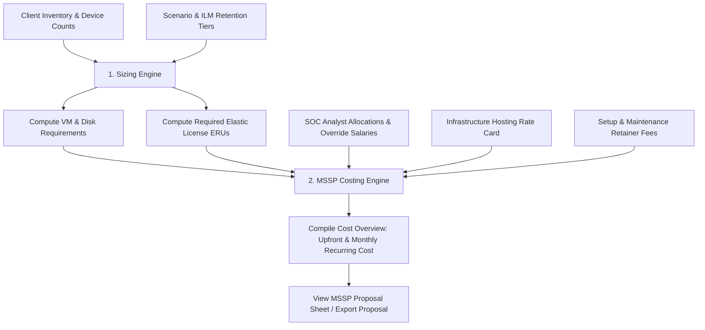

# ElasticCost — Elasticsearch Sizing & MSSP SOC Costing Calculator

**ElasticCost** is a professional planning, sizing, and costing application built on Laravel. It enables system architects to input an enterprise's device inventory, define custom calibration metrics, configure retention tiers (Hot, Warm, Cold, and Frozen), recommend cluster architectures (nodes, CPU/RAM, and storage tiers), and calculate **MSSP, MDR, and SOC service delivery pricing** (including analyst staffing, VM hosting infrastructure, subscription licensing, and maintenance retainers).

---

## 🚀 Key Features

### 1. Client Inventory & Asset Management
*   **Client Management (CRUD)**: Add, view, and delete client workspaces.
*   **Log Source Inventory**: Detail the log sources per client by configuring the count of devices (e.g., domain controllers, firewalls, servers).
*   **Custom Parameter Overrides**: Override default sizing metrics (Event size, EPS, monthly GB) at the client-asset level to handle unique system distributions.

### 2. Ingest Benchmarks & Calibration Modes
*   **Flexible Data Calibration**: Supports calibrating log sources using three primary modes:
    *   `eps_per_device`: Log volumes scale linearly with events-per-second (EPS) counts per device.
    *   `monthly_gb_per_device`: Sizing is calibrated based on a monthly raw log budget in Gigabytes per device.
    *   `monthly_gb_total`: Ingest is calculated from a fixed monthly total target (used for endpoint integrations).
*   **Default Sizing Catalog**: Pre-populated with baseline values for standard enterprise sources (Active Directory, FortiGate firewalls, Windows/Linux Servers, Network Switches, and EDR/XDR).

### 3. Scenario & Retention Lifecycle Planning (ILM)
*   **Lifecycle Tiers**: Configures index lifecycle management (ILM) by partitioning retention across four phases:
    *   **Hot Tier (NVMe SSD)**: High-speed ingestion and active querying.
    *   **Warm Tier (SATA SSD / HDD)**: Read-only indexing with high storage efficiency.
    *   **Cold Tier (Object Store + Local Cache)**: Searchable snapshots with 0% replica overhead.
    *   **Frozen Tier (Object Store Cache)**: Fully archived searchable snapshots on external storage.
*   **Replication Settings**: Manages replica counts per tier to accurately calculate total raw disk footprint and guard against data loss.

### 4. MSSP / MDR / SOC Costing Engine
*   **SOC Staffing Cost Allocations**: Models analyst operational overhead for L1, L2, and L3 Analysts, SOC Engineers, and SOC Managers. Computes monthly pricing based on configured salaries, active dedication percentages (%), and staffing counts for each client scenario.
*   **VM Hosting Rate Cards**: Dynamically estimates monthly infrastructure costs by mapping VM requirements (RAM, SSD, SATA) against configurable unit pricing rate cards.
*   **Onboarding & Maintenance Fees**: Incorporates setup fees (one-time) and maintenance retainer costs (monthly recurring).
*   **Cost Proposal Dashboard**: Renders a complete upfront vs. monthly recurring cost (MRC) proposal sheet for client presentation.
*   **Commercial Profit Markups**: Integrates multiple profit/benefit markup percentages (Assurance, Marketing, SOC Manager, CEO, and Fixed Profit margin) to compute the final Offered Client MRC.
*   **Elastic License Sharing**: Allows sharing the monthly Elastic Search license cost by a configurable percentage between clients instead of assigning dedicated licensing costs.

### 5. Dynamic Localization & Multi-Currency Support
*   **Language Switching**: Fully supports English, French, and Arabic dynamically based on user session selection.
*   **Active Currency Conversion**: Seamlessly converts all sizing, hosting, licensing, staffing, and onboarding cost parameters between USD, EUR, and TND using real-time dynamic exchange rates stored in the database.
*   **Custom Translation Manager**: Resolves customized translation overrides directly from a DB-backed translator (`CustomTranslator`), overriding baseline translation values without modifying physical language files.

### 6. AI-Powered Cost Proposal Analyst Agent
*   **Offer Analyst Agent**: Leverages a local Ollama AI model (such as `gemma4:e2b`) to audit and critique cybersecurity MSSP/SOC proposal costing details, providing pricing margin reviews and cluster topology recommendations.
*   **AI Connectivity Diagnostic**: Includes an API endpoint to ping and query active local Ollama server models, verifying health and availability of target LLM backends.

### 7. Multi-Format Export System
*   **Excel Export (`.xlsx`)**: Generates a professional workbook styled with deep slate and teal highlights, auto-fitted columns, active currency formats, and **live Excel formulas** (e.g., `=SUM()`, `=CEILING()`) rather than hardcoded metrics.
*   **Markdown Export (`.md`)**: Outputs a clean, portable report using standard formatting, LaTeX equations for cost derivations, Mermaid cluster diagrams, and the AI analysis audit.
*   **Word Export (`.doc`)**: Produces a rich, print-optimized document styled with inline HTML elements and embedded AI reviews.

---

## 🏛️ Application Architecture

The application is structured as a standard Model-View-Controller (MVC) system using **PHP 8.5** and **Laravel 13**.

### Sizing & Costing Logic Flow



### Database Schema & Entity Relationships

The data layer is defined via Eloquent models interacting with the following core tables:

| Table Name | Model | Key Fields | Purpose |
| :--- | :--- | :--- | :--- |
| `clients` | `Client` | `id`, `name`, `description` | Stores client profiles. |
| `asset_types` | `AssetType` | `id`, `name`, `avg_event_size_bytes`, `calibration_mode` | Default sizing benchmarks and calibration types. |
| `client_assets` | `ClientAsset` | `id`, `client_id`, `asset_type_id`, `device_count`, overrides | Maps client inventory and custom calibrations. |
| `scenarios` | `Scenario` | `id`, `name`, `workload_profile`, retention tier days & replicas | Templates for retention rules and workload targets. |
| `global_settings` | `GlobalSetting` | `key`, `value`, `description` | Holds constants like `usd_to_eur_rate` and `eru_cost_usd`. |
| `soc_roles` | `SocRole` | `id`, `name`, `default_monthly_salary`, `description` | Staffing roles templates (L1, L2, L3, Engineer, Manager). |
| `client_scenario_mssp_details` | `ClientScenarioMsspDetail` | `id`, client/scenario keys, fees, host RAM/disk rate card items, profit markup margins, license sharing status, `ai_analysis` | Configuration for flat retainers, hosting unit costs, profit margins, license sharing, and cached AI audit reviews. |
| `client_scenario_analyst_allocations` | `ClientScenarioAnalystAllocation` | `id`, details key, role key, percentage, custom salary, `staff_count` | Tracks dedication percentage and staff count of SOC engineers/analysts per scenario. |
| `translation_overrides` | `TranslationOverride` | `id`, `locale`, `key`, `value` | Stores dynamic multilingual UI translation string overrides. |
| `agent_conversations` | — | `id`, `user_id`, `title` | Laravel AI SDK table tracking conversation histories. |
| `agent_conversation_messages` | — | `id`, `conversation_id`, `role`, `content`, `tool_calls`, `tool_results` | Laravel AI SDK table storing conversation messages. |

---

## 📐 Core Costing & Sizing Formulas

### Ingest Volumes
$$\text{Daily Raw GB} = \frac{\text{Devices} \times \text{EPS} \times 86,400 \times \text{Event Size (Bytes)}}{10^9}$$

$$\text{Daily Indexed GB} = \text{Daily Raw GB} \times \text{Index Expansion Factor (1.25x)}$$

### Staffing Operational Cost
$$\text{Staffing Cost} = \sum \left( \text{Role Salary} \times \frac{\text{Allocation \%}}{100} \right)$$

### Infrastructure Node Hosting Costs
$$\text{RAM Cost} = \text{RAM GB} \times \text{Cost per GB} \times \text{Node Count}$$
$$\text{Disk Cost} = \text{Disk GB} \times \text{Cost per GB (by type: NVMe / SATA / SSD)} \times \text{Node Count}$$
$$\text{Infrastructure Cost} = \sum (\text{RAM Cost} + \text{Disk Cost})$$

### Total Service Proposal Pricing
$$\text{Total Upfront Cost} = \text{One-Time Setup Fee}$$
$$\text{Monthly Recurring Cost (MRC)} = \text{Staffing Cost} + \text{Infrastructure Cost} + \frac{\text{Annual Elastic License Cost}}{12} + \text{Monthly Maintenance Fee}$$

---

## 📂 Project Directory Structure

```text
elasticcost/
├── app/
│   ├── Ai/
│   │   └── Agents/
│   │       └── OfferAnalyst.php               # AI agent for evaluating costing proposals
│   ├── Http/
│   │   ├── Controllers/
│   │   │   ├── AssetTypeController.php        # Manages ingest benchmarks
│   │   │   ├── ClientAssetController.php      # Manages client-level inventory
│   │   │   ├── ClientController.php           # Handles client list/creation
│   │   │   ├── MsspCostingController.php      # Controls SOC pricing proposal edits & view
│   │   │   ├── ScenarioController.php         # Customizes scenario templates
│   │   │   ├── SizingDashboardController.php  # Processes dashboard rendering & export jobs
│   │   │   └── SystemSettingsController.php   # Handles global exchange rates and translation overrides
│   │   └── Middleware/
│   │       └── SetLocaleAndCurrency.php       # Sets session-based language locale and currency
│   ├── Models/
│   │   ├── AssetType.php                      # Ingest benchmarks mapping
│   │   ├── Client.php                         # Client model
│   │   ├── ClientAsset.php                    # Inventory model mapping
│   │   ├── ClientScenarioMsspDetail.php      # Costing fees & rate cards mapping
│   │   ├── ClientScenarioAnalystAllocation.php # Analyst client allocations
│   │   ├── GlobalSetting.php                  # Global pricing constants
│   │   ├── Scenario.php                       # Ingest & retention template model
│   │   ├── SocRole.php                        # SOC staffing roles
│   │   └── TranslationOverride.php            # Multilingual override model mapping
│   ├── Providers/
│   │   └── AppServiceProvider.php             # Boots dynamic translator overriding
│   └── Services/
│       ├── SizingEngine.php                   # Core calculator & VM profile matching
│       ├── MsspCostingEngine.php              # MSSP hosting & staffing pricing calculator
│       └── CustomTranslator.php               # Resolves DB translation overrides dynamically
├── database/
│   ├── migrations/                            # Schema definitions for sizing, mssp, and translations
│   └── seeders/
│       ├── DatabaseSeeder.php                 # Core seeder calling sizing and mssp seeders
│       ├── SizingSeeder.php                   # Seeds global settings, benchmarks, scenarios
│       └── MsspSeeder.php                     # Seeds default SOC role titles and baseline salaries
├── resources/
│   ├── views/                                 # Blade templates
│   │   ├── layouts/
│   │   │   └── app.blade.php                  # Base dashboard layout with dark/light themes
│   │   ├── clients/                           # Client detail & inventory edit screens
│   │   ├── asset_types/                       # Global log catalog index
│   │   ├── scenarios/                         # Scenario list & templates view
│   │   ├── settings/
│   │   │   └── system.blade.php               # System settings exchange rates & translation form
│   │   └── dashboard/
│   │       ├── sizing.blade.php               # Detailed metrics dashboard with topology graph
│   │       └── mssp.blade.php                 # Interactive MSSP cost calculator dashboard
│   └── lang/                                  # Translation dictionaries (en, fr, ar)
├── routes/
│   └── web.php                                # Route declarations for CRUD, settings, and exports
└── tests/
    └── Feature/
        ├── ExampleTest.php                    # Default fallback test
        ├── MsspCostingTest.php                # MSSP pricing, allocations, and AI endpoint tests
        ├── SizingExportTest.php               # Export format verification (Excel, Word, Markdown)
        └── SystemSettingsTest.php             # Translation and currency exchange rate tests
```
