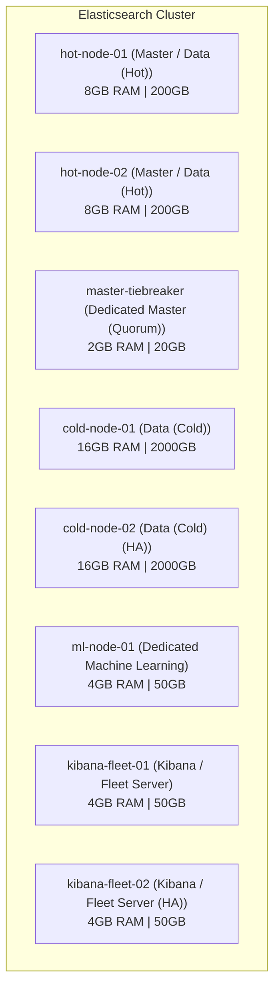

# Elasticsearch Sizing & Cost Report: Scenario 2 - Minimum Ingest, Multi-Tier (Long Retention)

This report details the architectural footprint and licensing cost for **Client "client44"** under **Scenario 2**.

---

## 1. Workload & Ingest Parameters

*   **Ingestion Profile**: **Min Workload**
*   **Daily Raw Log Volume**: **`3.84 GB/day`**
*   **Daily Indexed Volume (+25% Expansion)**: **`4.8 GB/day`**
*   **Retention Period**: **`365 Days`** (1 Year)
*   **ILM Data Lifecycle Tiers**:
    *   **Hot Tier**: **30 Days** (Primary + 1 Replica). Daily: 9.59 GB/day.
    *   **Cold Tier**: **335 Days** (Searchable Snapshots, 0% Replica overhead).

---

## 2. Storage Sizing Calculations

*   **Total Raw Data Stored**: 3.84 GB/day * 365 days = **1400.19 GB**
*   **Total Indexed Data (Active)**: 4.8 GB/day * 365 days = **1750.24 GB**
*   **Tier Storage Breakdown (Cluster Physical Footprint)**:
    *   **Hot Tier (NVMe SSD)**: **287.71 GB**
    *   **Cold Tier (Object Store + Local Cache)**: **3212.76 GB**
*   **Total Cluster Storage Required**: **3500.47 GB**

---

## 3. Recommended Cluster Architecture (On-Premises VMs)

| Node Name | Node Role | Count | RAM / Node | JVM Heap | Storage / Node | Storage Type |
| :--- | :--- | :---: | :---: | :---: | :---: | :--- |
| **hot-node-01** | Master / Data (Hot) | 1 | 8 GB | 4 GB | 200 GB | Local NVMe SSD |
| **hot-node-02** | Master / Data (Hot) | 1 | 8 GB | 4 GB | 200 GB | Local NVMe SSD |
| **master-tiebreaker** | Dedicated Master (Quorum) | 1 | 2 GB | 1 GB | 20 GB | Local SSD |
| **cold-node-01** | Data (Cold) | 1 | 16 GB | 8 GB | 2 TB | SATA SSD / HDD (Snapshot Cache) |
| **cold-node-02** | Data (Cold) (HA) | 1 | 16 GB | 8 GB | 2 TB | SATA SSD / HDD (Snapshot Cache) |
| **ml-node-01** | Dedicated Machine Learning | 1 | 4 GB | 2 GB | 50 GB | Local SSD |
| **kibana-fleet-01** | Kibana / Fleet Server | 1 | 4 GB | 2 GB | 50 GB | Local SSD |
| **kibana-fleet-02** | Kibana / Fleet Server (HA) | 1 | 4 GB | 2 GB | 50 GB | Local SSD |

### System Capacities:
*   **Total Cluster Memory Footprint**: **`62 GB RAM`**

---

## 4. Elastic Resource Unit (ERU) Licensing Cost

$$\text{Required ERUs} = \left\lceil \frac{62\text{ GB (Total RAM)}}{64\text{ GB (1 ERU)}} \right\rceil = \mathbf{1\text{ ERUs}}$$

> [!NOTE]
> **Licensing Verdict**: This configuration requires **`1 ERU`** subscription licenses. Annual projected license cost is **`$14,000.00`** based on $14,000.00/ERU assumptions.

### Cluster Topology Diagram

