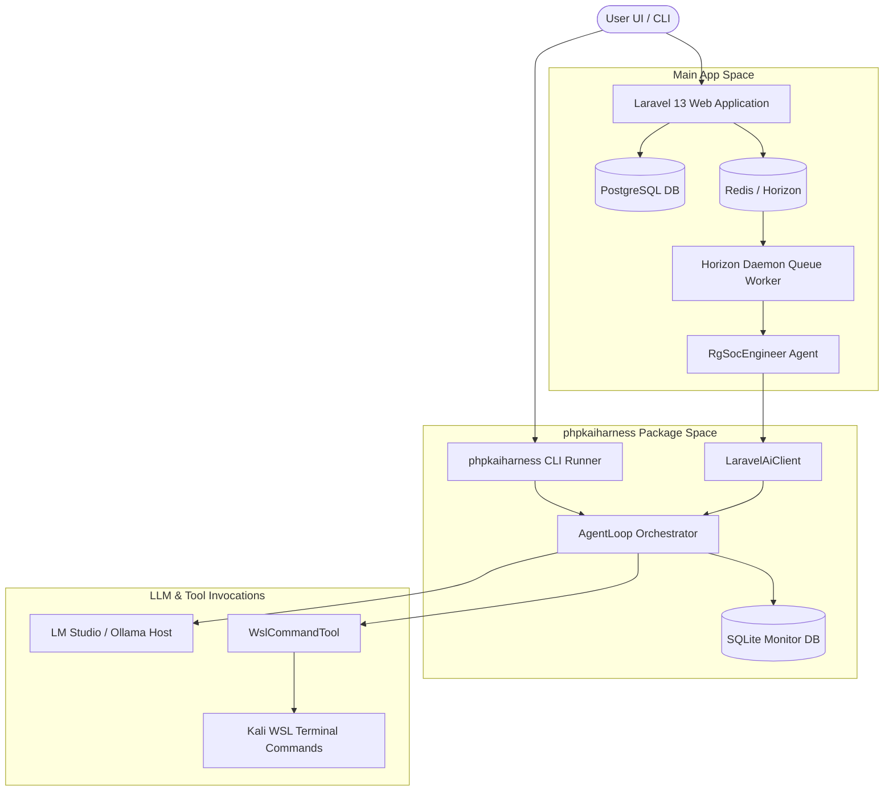

# Project Overview

Welcome, Agent! This document provides a high-level overview of the **elasticcost** project to help you understand its purpose, domains of operation, and overall technical architecture.

---

## 🏛️ What is ElasticCost?
**ElasticCost** is a specialized enterprise application designed for:
1. **Elasticsearch On-Premise Sizing**: Calculating hardware requirements (VM instances, CPU, RAM, and Storage allocations) across multiple hot, warm, cold, frozen, and dedicated node scenarios.
2. **MSSP / SOC Costing**: Formulating pricing models for Managed Security Services Providers (MSSP) and Security Operations Centers (SOC) including agent license sharing, staffing multipliers, margin calculations, and proposal generation.
3. **Agentic AI Assistance**: Providing interactive chat agents that can analyze sizing reports, modify configuration variables, audit client inventories, and execute command diagnostics in virtualized environments.

---

## 💻 Tech Stack & Ecosystem
The project is built on the modern Laravel ecosystem and leverages specialized local package integrations:

*   **PHP Version**: `8.5` (Optimized for modern typing and constructor properties)
*   **Framework**: Laravel `13` (using the modern bootstrap configuration in [app.php](file:///s:/elasticcost/bootstrap/app.php))
*   **AI Integration**: `laravel/ai` SDK (v0.7.2) for managing text gateways, providers, and message formatting
*   **Queueing**: Laravel Horizon & Redis (handling asynchronous, long-running agent execution tasks)
*   **Diagnostics Package**: `K415mm/phpkaiharness` (located in [packages/phpkaiharness](file:///s:/elasticcost/packages/phpkaiharness) - a standalone, pluggable PHP harness library)
*   **Databases**:
    *   **Main App**: PostgreSQL (for client, asset, and global configuration states)
    *   **Telemetry/Monitor**: SQLite (located at `~/.phpkaiharness/monitor.db` for zero-overhead, multi-process CLI tracing)

---

## 🧭 System Context Diagram

---

## 📂 Next Steps
To continue researching the codebase, check out these related files:
*   Read [02_COMPLETED_WORK.md](file:///s:/elasticcost/doc/agent_handbook/02_COMPLETED_WORK.md) for a timeline of implemented features.
*   Read [03_CORE_COMPONENTS.md](file:///s:/elasticcost/doc/agent_handbook/03_CORE_COMPONENTS.md) to understand calculation formulas and agent loops.
*   Read [04_DEVELOPMENT_WORKFLOW.md](file:///s:/elasticcost/doc/agent_handbook/04_DEVELOPMENT_WORKFLOW.md) for commands, testing protocols, and guidelines.
