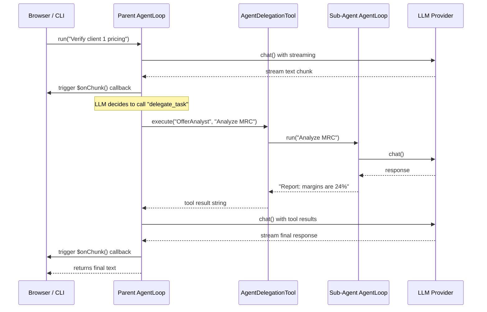

# Core Loop Enhancement Design — phpkaiharness

This document details the architectural design and specifications for adding **Streaming** and **Multi-Agent Delegation** to the `AgentLoop` layer.

---

## 1. Architectural Alignment & Compatibility

- **Streaming**: Handled via an optional stream callback `callable|null $onChunk` passed to `AgentLoop::run()` and `LlmClientInterface::chat()`. Synchronous return types are fully preserved.
- **Multi-Agent Delegation**: Handled as a generic, pluggable `AgentDelegationTool` implementing `ToolInterface`. It interacts with `AgentDiscoveryInterface` and runs a nested `AgentLoop` when invoked.
- **Event Broadcaster**: The `AgentLoop` dispatches a new `LlmStreamChunkReceived` event for every token chunk received, accessible to any PSR-14 event listener.

---

## 2. New Files Created

### Contracts
- `src/Contracts/Event/LlmStreamChunkReceivedInterface.php`

### Events (Concrete Implementations)
- `src/Events/AgentStarted.php`
- `src/Events/AgentFinished.php`
- `src/Events/LlmCallStarted.php`
- `src/Events/LlmCallFinished.php`
- `src/Events/LlmStreamChunkReceived.php`
- `src/Events/ToolCallStarted.php`
- `src/Events/ToolCallFinished.php`

### Tools
- `src/Tools/AgentDelegationTool.php`

---

## 3. Modified Files

- `src/Contracts/LlmClientInterface.php` — added `?callable $onChunk = null` parameter
- `src/Llm/LaravelAiClient.php` — accepts `$onChunk`, invokes on final response
- `src/Llm/LmStudioClient.php` — accepts `$onChunk`, real SSE streaming via Guzzle
- `src/Llm/OllamaClient.php` — accepts `$onChunk`, real NDJSON streaming via Guzzle
- `src/Llm/OpenRouterClient.php` — accepts `$onChunk`, real SSE streaming via Guzzle
- `src/Core/AgentLoop.php` — accepts `$onChunk`, `setAgentName()`, `setEventDispatcher()`, dispatches all lifecycle events

---

## 4. High-Level Streaming & Delegation Flow

