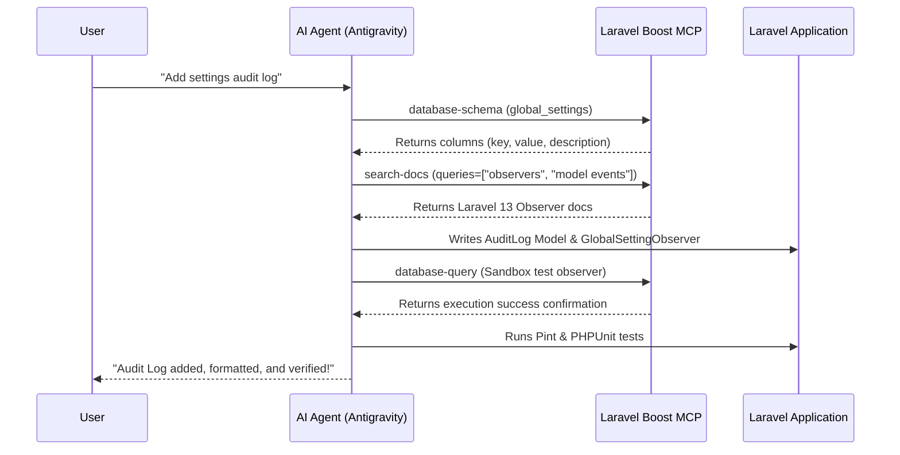

# Part 3: The Laravel Boost Workflow

In Part 2, we saw how an Agentic AI IDE (like Antigravity) automates file management, planning, and testing. However, a standard AI agent is still "blind" to the live state of your application—it cannot see the active database columns, the running server configuration, or version-specific package documentation without manual inspection.

This is where **Laravel Boost** comes in. 

Laravel Boost is a developer-enablement suite and **Model Context Protocol (MCP) server** that connects your AI agent directly to your running Laravel application. It turns the AI agent into an "insider" that understands your application's database, logs, configuration, and documentation with 100% precision.

---

## 🛠️ The Laravel Boost Toolset

When Laravel Boost is active, the AI agent gains access to specialized tools. Instead of running slow terminal scripts or guessing database models, the agent calls these tools directly:

| Tool Name | What it Does | Why it is a Game-Changer |
| :--- | :--- | :--- |
| `database-schema` | Inspects database table structures, columns, types, and indexes. | **No guessing**: The AI knows exactly what columns exist without opening TablePlus or reading old migration files. |
| `database-query` | Runs read-only SQL queries or Tinker expressions directly. | **Instant Verification**: The AI can query the database or run Tinker statements to check if model relationships work. |
| `search-docs` | Performs semantic searches across version-scoped documentation. | **Zero Hallucinations**: The AI retrieves documentation matching the *exact* package version in your `composer.lock` file. |
| `browser-logs` | Reads browser console errors and exceptions. | **Instant Frontend Debugging**: The AI sees runtime client-side exceptions and resolves them automatically. |
| `get-absolute-url` | Resolves app URLs, schemas, and ports. | **Accurate Links**: Resolves hostnames so the agent and user can view the local app correctly. |

---

## 🚀 Adding the Feature: The Laravel Boost Way

Let’s look at how the AI agent adds our **Settings Audit Log** feature when supercharged by Laravel Boost:



---

## Step-by-Step Walkthrough

### 1. Zero-Guess Schema Inspection
Traditionally, the agent would search files to see what columns are in `global_settings`. 
With Laravel Boost, the agent calls:
```json
database-schema { "table": "global_settings" }
```
In milliseconds, the agent receives the schema payload showing that `key` is the primary string, and `value` is text. It knows exactly how to map the `AuditLog` fields to match.

### 2. Version-Scoped Documentation Retrieval
Laravel changes its syntax and features across versions. To write code that matches **Laravel 13** and **PHP 8.5** perfectly, the agent calls:
```json
search-docs { "queries": ["model events", "observers"], "packages": ["laravel/framework"] }
```
Boost queries local documentation vector databases, returning the exact structure for observers matching Laravel 13. The agent does not generate deprecated code or pull outdated patterns from Google search results.

### 3. Sandbox Tinker Execution
To verify that the observer fires correctly, the agent doesn't need to run a manual script. It executes a sandbox command via:
```json
database-query { "query": "App\\Models\\GlobalSetting::first()->update(['value' => 'test']); App\\Models\\AuditLog::latest()->first();" }
```
It immediately receives the result. If the returned `AuditLog` row has the correct fields, the agent knows the observer behaves perfectly in the real application lifecycle.

### 4. Style Enforcement and Focused Testing
Finally, the agent runs Pint formatting and executes the tests. The `AGENTS.md` rules file (which Boost helps maintain) instructs the agent to run:
```bash
vendor/bin/pint --dirty --format agent
```
and
```bash
php artisan test --compact --filter=SystemSettingsAuditTest
```

The feature is implemented in minutes, with absolute correctness, and conforming to your project's precise styles and libraries.

---

## 💡 The Verdict: Why Use Laravel Boost?

1.  **Eliminates AI Hallucinations**: Because the AI reads the *actual* database schema and *actual* composer-locked documentation, it writes code that works on the first try.
2.  **Saves Developer Context**: You don't need to copy-paste schemas, config files, or logs into the chat window. Boost does this in the background, keeping your context window lightweight and clean.
3.  **Faster Debug Loops**: If something breaks, the AI uses `database-query` or `browser-logs` to diagnose the error, rather than asking you to run dump commands and paste output.

By combining an **Agentic IDE like Antigravity** with **Laravel Boost**, you unlock the ultimate modern Laravel development experience.

---

## 🎉 Next Steps

Now that you understand the difference between Traditional, Agentic, and Boosted workflows, you are ready to start building! 

*   Check out the project rules in [AGENTS.md](file:///s:/elasticcost/AGENTS.md).
*   Explore the application architecture in [PROJECT_SUMMARY.md](file:///s:/elasticcost/PROJECT_SUMMARY.md).
*   Start coding with Antigravity!

Happy coding! 🚀
