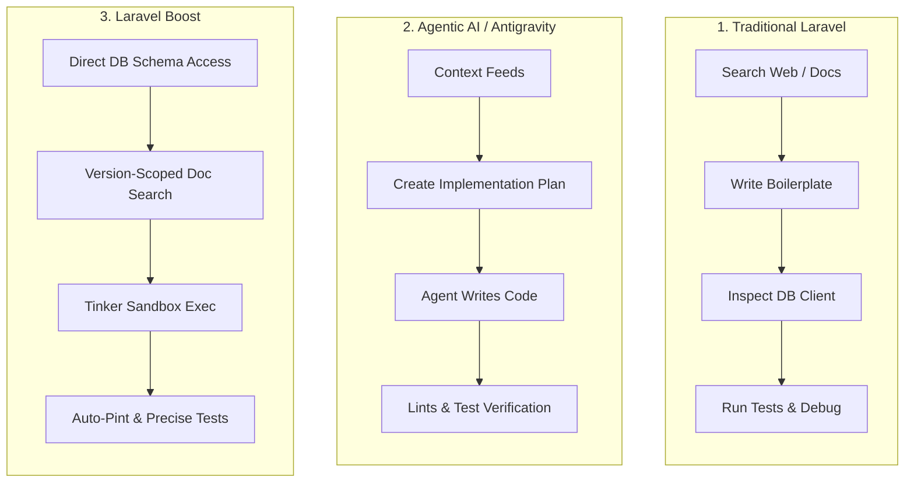

# Laravel Feature Development Walkthroughs

Welcome! If you are a Laravel developer who is starting to build apps or scaling existing ones, this guide is written especially for you. We assume you already know the basics of Laravel—such as routing, models, controllers, migrations, and Blade templates.

The purpose of this documentation is to show you a side-by-side comparison of **how to add a new feature to your application** using three completely different paradigms. By seeing the same feature added in three ways, you will learn not only how to work traditionally, but how to master modern AI-assisted workflows.

---

## 🗺️ Tutorial Roadmap

We have broken this walkthrough into three distinct, step-by-step guides. We recommend reading them in order to appreciate the evolution of the developer workflow.

| Section | Title | Primary Workflow Focus |
| :--- | :--- | :--- |
| **Part 1** | [01. Traditional Laravel Workflow](file:///s:/elasticcost/doc/walkthroughs/01_traditional_laravel.md) | Manual planning, terminal commands, browser searches, writing code, manual testing, and classic deployment. |
| **Part 2** | [02. Agentic AI (Antigravity) Workflow](file:///s:/elasticcost/doc/walkthroughs/02_agentic_ai_antigravity.md) | Collaborative, context-aware development with an AI agent. Using planning cycles, implementation plans, and automated verification loops. |
| **Part 3** | [03. Laravel Boost Workflow](file:///s:/elasticcost/doc/walkthroughs/03_laravel_boost.md) | Deep integration between the AI agent and the live Laravel application, utilizing system schema inspection, database query execution, and version-specific doc search. |

---

## 💡 The Paradigm Shift: Why This Matters

When we write software, we spend a significant amount of our day on non-coding tasks:
*   Reading files to recall how databases are structured.
*   Searching documentation to find correct method signatures.
*   Formatting our code to pass local linters.
*   Running test suites and debugging typos.

Here is how our relationship with these tasks changes across the three methods:

By understanding all three methodologies, you will be able to choose the right balance for your daily work and unlock massive developer velocity. Let's begin with **Part 1**!

👉 **[Go to Part 1: Traditional Laravel Workflow](file:///s:/elasticcost/doc/walkthroughs/01_traditional_laravel.md)**
