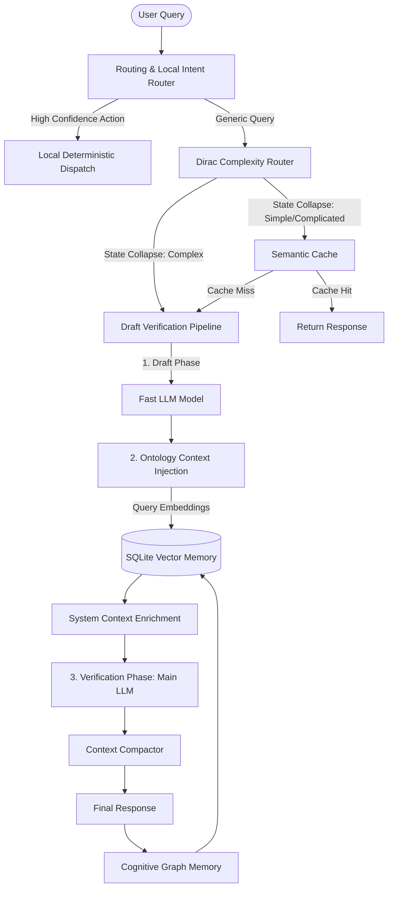

# Live Demo Guide: Phpkaiharness Core Architecture

This guide provides a clear, simplified description of each component within the `phpkaiharness` package and explains how they work together under the hood. Use this guide during your live demo to walk audience members through the technology step-by-step.

---

---

## 1. Dirac Complexity Router / Complexity Classifier
> **File:** [ComplexityClassifier.php](file:///s:/elasticcost/packages/phpkaiharness/src/Optimize/ComplexityClassifier.php)
* **What it is in a simple way:** The "traffic controller" of the package. It acts like a sorting hat, analyzing a user's prompt to determine if it is **Simple**, **Complicated**, or **Complex**, so the system can choose the cheapest and fastest way to solve it.
* **How it works:**
  1. It tokenizes the prompt and maps it to a mathematical state vector $|\psi\rangle$ in a 3-dimensional Hilbert space (Simple, Complicated, and Complex).
  2. It applies a **Permutation Operator** (swapping adjacent token weights) to calculate the query's symmetry eigenvalue. Highly structured or repetitive prompts are symmetric and lean towards **Simple**.
  3. It scans for mutating keywords (e.g., `update`, `simulate`) to push the score towards **Complex**, and database entities (e.g., `client`, `sizing`) to push it towards **Complicated**.
  4. Finally, it triggers a **state collapse** (measurement) into the highest probability density domain, returning the chosen domain.

---

## 2. Quantum-Inspired Memory Harness
> **File:** [QuantumInferenceEngine.php](file:///s:/elasticcost/packages/phpkaiharness/src/Optimize/QuantumInferenceEngine.php)
* **What it is in a simple way:** An advanced agent memory database (stored in SQLite) that retrieves past interactions using wave interference and entanglement.
* **How it works:**
  1. **Phase Interference:** Every agent has a unique "phase angle" (e.g., Security is $0$, Data is $\pi/2$). When searching memory, it calculates a fused similarity score:
     $$\text{Fused Score} = \alpha \cdot \text{Vector Cosine Similarity} + \beta \cdot \cos(\theta_{\text{query}} - \theta_{\text{node}})$$
     This causes out-of-phase nodes to destructively interfere (be filtered out) and in-phase nodes to constructively interfere (be boosted).
  2. **Entanglement Traversal:** Nodes are linked as "entangled pairs" with an entanglement force. When the system retrieves a memory anchor, any entangled nodes are automatically pulled into context.

---

## 3. Ontology Context Injection
> **File:** [OntologicalContextInjector.php](file:///s:/elasticcost/packages/phpkaiharness/src/Optimize/OntologicalContextInjector.php)
* **What it is in a simple way:** The bridge between the user's chat prompt and your Laravel Database. It automatically fetches real, current database records that are relevant to the user's question and feeds them directly to the AI.
* **How it works:**
  1. It embeds the user prompt into a vector.
  2. It scans records of the requested Laravel Model (like `ClientAsset`).
  3. It calculates the Cosine Similarity between the prompt vector and the database records.
  4. It formats the top-scoring records as JSON/text and injects them as a system context block into the prompt before sending it to the LLM.

---

## 4. Semantic Cache & Context Compactor
> **Files:** [SemanticCache.php](file:///s:/elasticcost/packages/phpkaiharness/src/Optimize/SemanticCache.php) | [ContextCompactor.php](file:///s:/elasticcost/packages/phpkaiharness/src/Optimize/ContextCompactor.php)
* **What they are in a simple way:** 
  * **Semantic Cache:** A smart recycling bin. If a user asks a question that was asked before (even if worded differently), it returns the cached response instantly without calling the LLM.
  * **Context Compactor:** A context manager that shrinks the conversation history when it gets too long, preventing "Out of Memory" token errors.
* **How they work:**
  * **Semantic Cache:** Uses three-tier matching: Exact match, Levenshtein fuzzy string distance, and Vector Cosine Similarity. It filters out mutating commands, ensures numbers/digits match exactly, and verifies that the referenced DB entities still exist.
  * **Context Compactor:** When history exceeds limits, it either slides the window (dropping intermediate tool logs while keeping the root query and the last few turns) or uses the LLM to summarize the intermediate history into a single compact system message.

---

## 5. Cognitive Graph Memory
> **File:** [CognitiveGraphMemory.php](file:///s:/elasticcost/packages/phpkaiharness/src/Optimize/CognitiveGraphMemory.php)
* **What it is in a simple way:** A facts-harvester. After the agent finishes a task, it reads what happened, extracts new lessons, configurations, or facts, and saves them to the persistent graph database for future runs.
* **How it works:**
  1. It performs a post-execution LLM call asking for a flat list of concrete updates or discoveries from the trace.
  2. It runs the extracted statements through quality filters (minimum length, certainty checks, and markdown filters).
  3. It runs a deduplication check ($\ge 85\%$ string similarity check) against existing facts.
  4. It saves the unique, verified facts into SQLite, categorized as `setting_change`, `creation`, or `allocation`.

---

## 6. Draft Verification Pipeline
> **File:** [DraftVerificationOrchestration.php](file:///s:/elasticcost/packages/phpkaiharness/src/Optimize/DraftVerificationOrchestration.php)
* **What it is in a simple way:** The "Think-twice" system. Before answering a complex question, the package writes a fast draft, retrieves confirming/challenging evidence, and then hands it to the main LLM to audit and generate the final answer.
* **How it works:**
  1. **Draft:** Calls a fast LLM to produce a quick, raw draft solution.
  2. **Retrieve:** Queries the SQLite vector memory and Eloquent database using the draft content to fetch matching records.
  3. **Verify:** Bundles the draft and evidence into a hidden system prompt, instructing the main LLM to audit the draft, ignore false assumptions, and produce the final polished response.

---

## 7. Routing & Local Intent
> **Files:** [LocalIntentRouter.php](file:///s:/elasticcost/app/Ai/Routing/LocalIntentRouter.php) | [LocalIntentEvidenceExtractor.php](file:///s:/elasticcost/app/Ai/Routing/LocalIntentEvidenceExtractor.php)
* **What it is in a simple way:** A fast-track shortcut. If the user types a command that can be answered instantly using code (like "change SIEM price to $200"), it runs it locally in PHP instead of wasting time and tokens on the LLM.
* **How it works:**
  1. The `EvidenceExtractor` scans the prompt for Action Verbs, targets, and negative/hypothetical markers.
  2. It computes a confidence score. If it is a clear, actionable command (confidence $\ge 0.9$), the `LocalIntentRouter` classifies it as `local-intent-action`.
  3. The agent engineer intercepts this and executes the action deterministically in code, bypassing the LLM. If the intent is unclear, it falls back to the full LLM agent loop.
