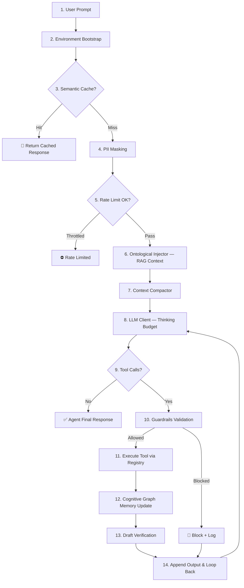

<div align="center">
  <div style="background:#0c1017;border:2px solid #3cd2a5;border-radius:12px;padding:32px 28px 24px;margin-bottom:24px;box-shadow:0 0 40px rgba(60,210,165,0.2)">
    <h1 style="color:#3cd2a5;font-family:'Courier New',Courier,monospace;letter-spacing:3px;font-weight:bold;margin:0 0 8px">🤖 PHP KAI HARNESS</h1>
    <p style="color:#8a99ad;font-size:1.1em;margin:0 0 18px">State-of-the-Art Agentic Harness & HUD Telemetry for PHP & Laravel 13</p>
    <div style="display:flex;justify-content:center;gap:8px;flex-wrap:wrap">
      
      
      
      
      
      
    </div>
  </div>
</div>

`phpkaiharness` is a **production-grade, pluggable AI Agent Harness** for PHP & Laravel 13. It gives you an autonomous LLM execution loop enriched with enterprise-grade safety, optimization, and observability features — all without leaving the PHP ecosystem.

---

<h2 style="color:#3cd2a5;font-family:'Courier New',Courier,monospace;border-bottom:2px solid #3cd2a5;padding-bottom:8px;margin-top:30px">🏗️ Architecture Overview</h2>



---

<h2 style="color:#3cd2a5;font-family:'Courier New',Courier,monospace;border-bottom:2px solid #3cd2a5;padding-bottom:8px;margin-top:30px">✨ Features</h2>

<div style="display:grid;grid-template-columns:repeat(auto-fit,minmax(300px,1fr));gap:14px;margin-top:15px">

  <div style="background:#0c1017;border:1px solid rgba(60,210,165,0.35);border-radius:8px;padding:16px;box-shadow:0 0 10px rgba(60,210,165,0.07)">
    <h3 style="color:#3cd2a5;font-family:'Courier New',Courier,monospace;margin-top:0">🔄 Autonomous Agent Loop</h3>
    <p style="color:#b1c2d4;font-size:0.9em;margin:0">Drives the full LLM thought-action-observation cycle. Configurable max-iterations guard against runaway loops. Streams token-by-token via SSE callbacks.</p>
  </div>

  <div style="background:#0c1017;border:1px solid rgba(60,210,165,0.35);border-radius:8px;padding:16px;box-shadow:0 0 10px rgba(60,210,165,0.07)">
    <h3 style="color:#3cd2a5;font-family:'Courier New',Courier,monospace;margin-top:0">🔀 LLM Failover</h3>
    <p style="color:#b1c2d4;font-size:0.9em;margin:0"><code>FailoverLlmClient</code> accepts a prioritized stack of providers (Ollama → LM Studio → OpenRouter → laravel/ai). Automatic retry on HTTP 4xx/5xx with provider-level circuit breaking.</p>
  </div>

  <div style="background:#0c1017;border:1px solid rgba(60,210,165,0.35);border-radius:8px;padding:16px;box-shadow:0 0 10px rgba(60,210,165,0.07)">
    <h3 style="color:#3cd2a5;font-family:'Courier New',Courier,monospace;margin-top:0">💾 Semantic Cache</h3>
    <p style="color:#b1c2d4;font-size:0.9em;margin:0">Returns cached responses for semantically similar prompts using SQLite-backed similarity matching with a configurable threshold (default 0.88). Slash token costs on repeated queries.</p>
  </div>

  <div style="background:#0c1017;border:1px solid rgba(60,210,165,0.35);border-radius:8px;padding:16px;box-shadow:0 0 10px rgba(60,210,165,0.07)">
    <h3 style="color:#3cd2a5;font-family:'Courier New',Courier,monospace;margin-top:0">🕵️ PII Masking</h3>
    <p style="color:#b1c2d4;font-size:0.9em;margin:0">Regex-based redaction of emails, IP addresses, credit card numbers, and API keys before prompts are sent to any LLM. Masking applied symmetrically to incoming responses too.</p>
  </div>

  <div style="background:#0c1017;border:1px solid rgba(60,210,165,0.35);border-radius:8px;padding:16px;box-shadow:0 0 10px rgba(60,210,165,0.07)">
    <h3 style="color:#3cd2a5;font-family:'Courier New',Courier,monospace;margin-top:0">⏱️ Rate Limiting</h3>
    <p style="color:#b1c2d4;font-size:0.9em;margin:0">Token-bucket rate limiter throttles outbound LLM requests against a sliding-window counter stored in SQLite. Prevents HTTP 429 errors and runaway API cost spikes.</p>
  </div>

  <div style="background:#0c1017;border:1px solid rgba(60,210,165,0.35);border-radius:8px;padding:16px;box-shadow:0 0 10px rgba(60,210,165,0.07)">
    <h3 style="color:#3cd2a5;font-family:'Courier New',Courier,monospace;margin-top:0">🛡️ Guardrails</h3>
    <p style="color:#b1c2d4;font-size:0.9em;margin:0">Scope-based policy engine blocks high-risk tool executions before they hit the terminal. Configurable allow/deny lists per tool name and argument patterns.</p>
  </div>

  <div style="background:#0c1017;border:1px solid rgba(60,210,165,0.35);border-radius:8px;padding:16px;box-shadow:0 0 10px rgba(60,210,165,0.07)">
    <h3 style="color:#3cd2a5;font-family:'Courier New',Courier,monospace;margin-top:0">🧠 Model Prompt Optimizer</h3>
    <p style="color:#b1c2d4;font-size:0.9em;margin:0">Auto-rewrites system prompts for specific model architectures. Includes built-in profiles for <strong>Qwen 3.5</strong> and <strong>Gemma 4</strong> to maximize instruction-following and tool-call accuracy.</p>
  </div>

  <div style="background:#0c1017;border:1px solid rgba(60,210,165,0.35);border-radius:8px;padding:16px;box-shadow:0 0 10px rgba(60,210,165,0.07)">
    <h3 style="color:#3cd2a5;font-family:'Courier New',Courier,monospace;margin-top:0">🔗 Ontological Injector</h3>
    <p style="color:#b1c2d4;font-size:0.9em;margin:0">RAG-style context injection — fetches relevant Eloquent records via semantic embedding lookups before each LLM call. Grounds agent responses in live application data.</p>
  </div>

  <div style="background:#0c1017;border:1px solid rgba(60,210,165,0.35);border-radius:8px;padding:16px;box-shadow:0 0 10px rgba(60,210,165,0.07)">
    <h3 style="color:#3cd2a5;font-family:'Courier New',Courier,monospace;margin-top:0">🕸️ Cognitive Graph Memory</h3>
    <p style="color:#b1c2d4;font-size:0.9em;margin:0">Persistent knowledge graph across agent sessions. Stores entity relationships extracted from tool outputs, enabling multi-turn reasoning over accumulated observations.</p>
  </div>

  <div style="background:#0c1017;border:1px solid rgba(60,210,165,0.35);border-radius:8px;padding:16px;box-shadow:0 0 10px rgba(60,210,165,0.07)">
    <h3 style="color:#3cd2a5;font-family:'Courier New',Courier,monospace;margin-top:0">✅ Draft Verification</h3>
    <p style="color:#b1c2d4;font-size:0.9em;margin:0">Orchestrates a secondary verification pass on agent-generated drafts before committing final responses. Catches hallucinations and factual errors at the loop boundary.</p>
  </div>

  <div style="background:#0c1017;border:1px solid rgba(60,210,165,0.35);border-radius:8px;padding:16px;box-shadow:0 0 10px rgba(60,210,165,0.07)">
    <h3 style="color:#3cd2a5;font-family:'Courier New',Courier,monospace;margin-top:0">💡 Thinking Budget</h3>
    <p style="color:#b1c2d4;font-size:0.9em;margin:0"><code>ThinkingBudgetLlmClient</code> injects structured reasoning steps (<em>think</em> → <em>act</em> → <em>observe</em>) before each LLM call. Improves multi-step planning quality on complex tasks.</p>
  </div>

  <div style="background:#0c1017;border:1px solid rgba(60,210,165,0.35);border-radius:8px;padding:16px;box-shadow:0 0 10px rgba(60,210,165,0.07)">
    <h3 style="color:#3cd2a5;font-family:'Courier New',Courier,monospace;margin-top:0">📟 HUD Telemetry Dashboard</h3>
    <p style="color:#b1c2d4;font-size:0.9em;margin:0">Real-time animated workflow trace viewer, session explorer, agent playground, and category-based config panel — all in a cyber-teal dark UI. Every feature has a live ACTIVE/DEACTIVATED status badge.</p>
  </div>

  <div style="background:#0c1017;border:1px solid rgba(60,210,165,0.35);border-radius:8px;padding:16px;box-shadow:0 0 10px rgba(60,210,165,0.07)">
    <h3 style="color:#3cd2a5;font-family:'Courier New',Courier,monospace;margin-top:0">☁️ Qwen Cloud Provider</h3>
    <p style="color:#b1c2d4;font-size:0.9em;margin:0">Native <strong>Qwen Cloud (DashScope)</strong> integration with hybrid credential resolution — reads API key, URL, and model from the host app's <code>global_settings</code> first, then falls back to harness config and env vars. Supports qwen3/qwq <code>enable_thinking=false</code>, structured JSON output, and streaming.</p>
  </div>

  <div style="background:#0c1017;border:1px solid rgba(60,210,165,0.35);border-radius:8px;padding:16px;box-shadow:0 0 10px rgba(60,210,165,0.07)">
    <h3 style="color:#3cd2a5;font-family:'Courier New',Courier,monospace;margin-top:0">⚛️ Quantum Memory Harness</h3>
    <p style="color:#b1c2d4;font-size:0.9em;margin:0">Quantum-inspired ontological memory with cosine + phase interference scoring (<code>S_fused = α·S_cos + β·S_interfere</code>), multi-hop entanglement traversal, and asynchronous memory collapse jobs. Persists across sessions in a dedicated SQLite graph.</p>
  </div>

</div>

---

<h2 style="color:#3cd2a5;font-family:'Courier New',Courier,monospace;border-bottom:2px solid #3cd2a5;padding-bottom:8px;margin-top:30px">⚡ Quickstart</h2>

```php
use Phpkaiharness\Llm\QwenClient;
use Phpkaiharness\Llm\OllamaClient;
use Phpkaiharness\Llm\FailoverLlmClient;
use Phpkaiharness\Llm\PiiMaskingLlmClient;
use Phpkaiharness\Llm\RateLimitedLlmClient;
use Phpkaiharness\Core\AgentLoop;
use Phpkaiharness\Core\Registry\ToolRegistry;
use Phpkaiharness\Optimize\SemanticCache;
use Phpkaiharness\Optimize\Guardrails;
use Phpkaiharness\Monitor\SqliteMonitorStore;
use Phpkaiharness\Tools\WslCommandTool;

// 1. Build a resilient LLM client stack with failover + PII masking + rate limiting
//    QwenClient reads credentials from global_settings (host app) → harness config → env vars
$primary   = new QwenClient(defaultModel: 'qwen-plus');
$secondary = new OllamaClient('http://localhost:11434', 'llama3');

$llmClient = new PiiMaskingLlmClient(
    new RateLimitedLlmClient(
        new FailoverLlmClient([$primary, $secondary]),
        requestsPerMinute: 60
    )
);

// 2. Register tools with guardrails
$registry = new ToolRegistry();
$registry->attach(new WslCommandTool(
    name: 'network_diagnostics',
    description: 'Runs network lookup tools in Kali WSL.',
    allowedBinaries: ['dig', 'nslookup', 'ping']
));

// 3. Plug in semantic cache + guardrails
$dbPath      = database_path('harness.sqlite');
$cache       = new SemanticCache($dbPath, threshold: 0.88);
$guardrails  = new Guardrails();
$collector   = new SqliteMonitorStore($dbPath);

// 4. Boot the loop
$agent = new AgentLoop(
    llmClient:       $llmClient,
    registry:        $registry,
    systemPrompt:    "You are a networking bot. Solve user issues using available tools.",
    model:           'qwen-plus',
    semanticCache:   $cache,
    guardrails:      $guardrails,
    maxIterations:   10
);

// 5. Run
$history   = [];
$sessionId = bin2hex(random_bytes(8));
$response  = $agent->run("Check DNS records for google.com", $history, $sessionId, $collector);

echo $response;
```

---

<h2 style="color:#3cd2a5;font-family:'Courier New',Courier,monospace;border-bottom:2px solid #3cd2a5;padding-bottom:8px;margin-top:30px">🚀 Laravel 13 Integration in 3 Steps</h2>

<ol style="color:#b1c2d4;font-family:sans-serif;line-height:1.8">
  <li>
    <strong>Install Package</strong>: Add the VCS repository to your <code>composer.json</code> and require the package:
    <pre><code class="language-bash">composer config repositories.phpkaiharness vcs "https://github.com/K415mm/phpkaiharness-.git"
composer require kai/phpkaiharness:dev-main</code></pre>
  </li>
  <li>
    <strong>Publish & Install Config & Assets</strong>: Run the installer command to publish configuration and assets and initialize the SQLite DB:
    <pre><code class="language-bash">php artisan harness:install</code></pre>
  </li>
  <li>
    <strong>Access the Telemetry Dashboard</strong>: Start your server (<code>php artisan serve</code>) then open:
    <ul style="margin-top:5px;list-style-type:square">
      <li>📊 Workflow Trace Viewer & Agent Runner: <code>/harness/dashboard</code></li>
      <li>⚙️ Configuration Panel: <code>/harness/config</code></li>
    </ul>
  </li>
</ol>

<h3 style="color:#3cd2a5;font-family:'Courier New',Courier,monospace;margin-top:20px">🔒 Route Protection & Security</h3>
<p style="color:#b1c2d4;line-height:1.6">
  By default, telemetry and configuration routes are only accessible in the <code>local</code> environment (determined by <code>app()->isLocal()</code>). To authorize access in other environments (e.g., staging or production), define a <code>viewHarness</code> Gate in your <code>AuthServiceProvider</code>:
</p>
<pre><code class="language-php">use App\Models\User;
use Illuminate\Support\Facades\Gate;

Gate::define('viewHarness', function (User $user) {
    return in_array($user->email, [
        'admin@example.com',
    ]);
});</code></pre>

<h3 style="color:#3cd2a5;font-family:'Courier New',Courier,monospace;margin-top:20px">🙈 Ignoring SQLite Telemetry Database</h3>
<p style="color:#b1c2d4;line-height:1.6">
  It is recommended to add the SQLite monitor database folder to your project's <code>.gitignore</code>:
</p>
<pre><code>/storage/app/phpkaiharness/
</code></pre>

---

<h2 style="color:#3cd2a5;font-family:'Courier New',Courier,monospace;border-bottom:2px solid #3cd2a5;padding-bottom:8px;margin-top:30px">🔧 Configuration Reference</h2>

All features are togglable via `config/harness.php` and persist through the dashboard UI:

```php
return [
    'default' => [
        'provider'       => env('PHPKAIHARNESS_PROVIDER', 'qwen'),
        'model'          => env('PHPKAIHARNESS_MODEL', 'qwen-plus'),
        'max_iterations' => 10,
    ],

    'cache' => [
        'db_path' => env('PHPKAIHARNESS_DB_PATH', database_path('harness.sqlite')),
    ],

    // Qwen Cloud provider — hybrid credential resolution
    'qwen_provider' => [
        'enabled'           => env('PHPKAIHARNESS_QWEN_ENABLED', true),
        'api_key'           => env('PHPKAIHARNESS_QWEN_KEY') ?: (env('QWEN_API_KEY') ?: env('DASHSCOPE_API_KEY', '')),
        'url'               => env('PHPKAIHARNESS_QWEN_URL') ?: (env('QWEN_URL') ?: env('DASHSCOPE_URL', 'https://dashscope-intl.aliyuncs.com/compatible-mode/v1')),
        'model'             => env('PHPKAIHARNESS_QWEN_MODEL', 'qwen-plus'),
        'light_model'       => env('PHPKAIHARNESS_QWEN_LIGHT_MODEL', 'qwen-turbo'),
        'structured_output' => env('PHPKAIHARNESS_QWEN_STRUCTURED', 'json_object'),
        'max_tokens'        => env('PHPKAIHARNESS_QWEN_MAX_TOKENS', 4096),
    ],

    // Feature toggles — reflected live in the HUD dashboard
    'semantic_cache'         => ['enabled' => true,  'threshold' => 0.88],
    'pii_masking'            => ['enabled' => true],
    'rate_limiting'          => ['enabled' => true,  'requests_per_minute' => 60],
    'guardrails'             => ['enabled' => true],
    'model_prompt_optimizer' => ['enabled' => true,  'profile' => 'auto'],
    'ontological_injector'   => ['enabled' => true],
    'thinking_budget'        => ['enabled' => false, 'max_thinking_tokens' => 8000],
    'cognitive_graph_memory' => ['enabled' => true],
    'draft_verification'     => ['enabled' => false],
    'context_compactor'      => ['enabled' => true,  'window_size' => 6],
    'llm_failover'           => ['enabled' => true],
    'streaming'              => ['enabled' => false],

    'pii_masking' => [
        'enabled'  => true,
        'patterns' => [
            'EMAIL'       => '/[a-zA-Z0-9._%+-]+@[a-zA-Z0-9.-]+\.[a-zA-Z]{2,}/',
            'IP'          => '/\b\d{1,3}\.\d{1,3}\.\d{1,3}\.\d{1,3}\b/',
            'CREDIT_CARD' => '/\b(?:\d[ -]*?){13,16}\b/',
            'API_KEY'     => '/(?i)(api[-_]?key|secret|token)[\\s]*[:=][\\s]*["\']?[a-zA-Z0-9]{16,}["\']?/',
        ],
    ],

    'telemetry' => [
        'enabled'      => true,
        'route_prefix' => 'harness',
        'middleware'   => ['web'],
    ],
];
```

> [!TIP]
> **Hybrid Credential Resolution:** When integrated into a host Laravel app, `QwenClient` automatically reads the API key, URL, and model from the host app's `global_settings` database table (via `GlobalSetting::getValue('qwen_api_key')`, etc.) — no duplicate configuration needed. The harness config and env vars serve as fallbacks for standalone usage.

> [!IMPORTANT]
> **Qwen3/Qwq Models:** The `QwenClient` automatically sends `enable_thinking=false` for `qwen3*` and `qwq*` models to prevent hanging on non-streaming calls. This is handled transparently — no manual configuration required.

---

<h2 style="color:#3cd2a5;font-family:'Courier New',Courier,monospace;border-bottom:2px solid #3cd2a5;padding-bottom:8px;margin-top:30px">📖 Documentation</h2>

<table style="width:100%;border-collapse:collapse;border:1px solid #3cd2a5;font-family:sans-serif">
  <thead>
    <tr style="background-color:rgba(60,210,165,0.1);border-bottom:2px solid #3cd2a5">
      <th style="padding:12px;text-align:left;color:#3cd2a5;border-right:1px solid #3cd2a5">Guide</th>
      <th style="padding:12px;text-align:left;color:#3cd2a5">Contents</th>
    </tr>
  </thead>
  <tbody>
    <tr style="border-bottom:1px solid rgba(60,210,165,0.2)">
      <td style="padding:12px;border-right:1px solid #3cd2a5;font-weight:bold"><a href="doc/architecture.md" style="color:#3cd2a5;text-decoration:none">🏢 High-Level Architecture</a></td>
      <td style="padding:12px;color:#b1c2d4">System context, execution sequence diagrams, telemetry pipeline, and PSR-14 event hooks.</td>
    </tr>
    <tr style="border-bottom:1px solid rgba(60,210,165,0.2)">
      <td style="padding:12px;border-right:1px solid #3cd2a5;font-weight:bold"><a href="doc/components.md" style="color:#3cd2a5;text-decoration:none">🔧 Component Specs (LLA)</a></td>
      <td style="padding:12px;color:#b1c2d4">Detailed API specs for AgentLoop, all LLM clients, tool classes, middleware, and optimization layers.</td>
    </tr>
    <tr style="border-bottom:1px solid rgba(60,210,165,0.2)">
      <td style="padding:12px;border-right:1px solid #3cd2a5;font-weight:bold"><a href="doc/features.md" style="color:#3cd2a5;text-decoration:none">🛡️ Features Reference</a></td>
      <td style="padding:12px;color:#b1c2d4">PII masking patterns, semantic cache algorithm, guardrails policy, rate limiting, and SQLite schema.</td>
    </tr>
    <tr style="border-bottom:1px solid rgba(60,210,165,0.2)">
      <td style="padding:12px;border-right:1px solid #3cd2a5;font-weight:bold"><a href="doc/laravel_integration.md" style="color:#3cd2a5;text-decoration:none">🚀 Laravel 13 Integration</a></td>
      <td style="padding:12px;color:#b1c2d4">Full setup guide, env config, route protection, service provider, and Laravel-specific usage patterns.</td>
    </tr>
    <tr style="border-bottom:1px solid rgba(60,210,165,0.2)">
      <td style="padding:12px;border-right:1px solid #3cd2a5;font-weight:bold"><a href="doc/aip_ontology_interoperability.md" style="color:#3cd2a5;text-decoration:none">🔗 Ontology & Interoperability</a></td>
      <td style="padding:12px;color:#b1c2d4">Ontological context injection patterns, RAG-powered record retrieval, and Laravel AI SDK interoperability design.</td>
    </tr>
  </tbody>
</table>

---

<h2 style="color:#3cd2a5;font-family:'Courier New',Courier,monospace;border-bottom:2px solid #3cd2a5;padding-bottom:8px;margin-top:30px">🧩 LLM Provider Stack</h2>

| Provider | Class | Notes |
|---|---|---|
| **Qwen Cloud** (default) | `QwenClient` | DashScope API, hybrid credentials, qwen3/qwq `enable_thinking=false`, structured JSON output, streaming |
| **Ollama** (local) | `OllamaClient` | Hermes 3, Llama 3, Gemma 4, Qwen 3.5+ |
| **LM Studio** (local) | `LmStudioClient` | Standard REST chat completions API |
| **OpenRouter** (cloud) | `OpenRouterClient` | 200+ models via single API key |
| **laravel/ai** | `LaravelAiClient` | Native Laravel 13 AI SDK connections, auto-routes qwen→QwenClient |
| **Failover Stack** | `FailoverLlmClient` | Wraps any of the above with auto-retry |

---

<h2 style="color:#3cd2a5;font-family:'Courier New',Courier,monospace;border-bottom:2px solid #3cd2a5;padding-bottom:8px;margin-top:30px">🗂️ Package Structure</h2>

```
phpkaiharness/
├── src/
│   ├── Core/
│   │   ├── AgentLoop.php             ← Central execution engine
│   │   ├── AgentSelector.php         ← Multi-agent discovery
│   │   └── Registry/ToolRegistry.php ← Dynamic tool management
│   ├── Llm/
│   │   ├── QwenClient.php           ← Qwen Cloud (DashScope) — default provider
│   │   ├── OllamaClient.php          ← Local Ollama adapter
│   │   ├── LmStudioClient.php        ← LM Studio adapter
│   │   ├── OpenRouterClient.php      ← Cloud OpenRouter adapter
│   │   ├── LaravelAiClient.php       ← laravel/ai native integration
│   │   ├── FailoverLlmClient.php     ← Multi-provider failover
│   │   ├── PiiMaskingLlmClient.php   ← PII redaction decorator
│   │   ├── RateLimitedLlmClient.php  ← Rate limiter decorator
│   │   ├── ThinkingBudgetLlmClient.php ← Chain-of-thought decorator
│   │   └── ModelCatalog.php          ← Model architecture registry
│   ├── Optimize/
│   │   ├── SemanticCache.php         ← Semantic response cache
│   │   ├── ContextCompactor.php      ← Sliding-window compactor
│   │   ├── Guardrails.php            ← Policy safety engine
│   │   ├── ModelPromptOptimizer.php  ← Qwen/Gemma prompt rewriter
│   │   ├── OntologicalContextInjector.php ← RAG context injection
│   │   ├── CognitiveGraphMemory.php  ← Persistent knowledge graph
│   │   ├── QuantumInferenceEngine.php ← Quantum-inspired memory scoring
│   │   └── DraftVerificationOrchestration.php ← Output verification
│   ├── Http/
│   │   ├── Controllers/
│   │   │   ├── HarnessConfigController.php
│   │   │   └── HarnessTelemetryController.php
│   │   └── Middleware/
│   │       ├── EnvironmentBootstrapMiddleware.php
│   │       ├── PolicyGuardrailMiddleware.php
│   │       ├── QuantumOntologyMemoryMiddleware.php
│   │       └── CompressContextMiddleware.php
│   ├── Console/Commands/
│   │   ├── InstallCommand.php        ← Publish config + init SQLite
│   │   └── ConfigValidateCommand.php ← Validate harness config
│   ├── Tools/
│   │   ├── WslCommandTool.php        ← Kali WSL sandboxed executor
│   │   ├── HttpServiceTool.php       ← External microservice bridge
│   │   ├── AgentDelegationTool.php   ← Child agent spawner
│   │   ├── AsynchronousWebhookTool.php ← Async webhook dispatcher
│   │   └── QueryGraphMemoryTool.php  ← Graph memory query tool
│   └── Monitor/
│       └── SqliteMonitorStore.php    ← Self-contained telemetry DB
├── resources/views/
│   ├── dashboard.blade.php           ← Animated workflow trace viewer
│   └── config.blade.php             ← Category-based config panel
├── ui/                               ← Standalone PHP UI (no Laravel)
├── config/harness.php
├── routes/web.php
└── tests/                           ← 93 passing tests (Pest)
```

---

<h2 style="color:#3cd2a5;font-family:'Courier New',Courier,monospace;border-bottom:2px solid #3cd2a5;padding-bottom:8px;margin-top:30px">🧪 Testing</h2>

```bash
# Run all 93 tests
composer test

# Or directly via PHPUnit
./vendor/bin/phpunit

# Individual test suites
./vendor/bin/phpunit tests/AgentHarnessTest.php
./vendor/bin/phpunit tests/LlmClientLayerTest.php
./vendor/bin/phpunit tests/AdvancedHarnessTest.php
```

---

<h2 style="color:#3cd2a5;font-family:'Courier New',Courier,monospace;border-bottom:2px solid #3cd2a5;padding-bottom:8px;margin-top:30px">🤝 Contributing & License</h2>

Open an issue or PR to add new LLM adapters, optimization filters, or tool integrations.

This project is licensed under the **MIT License**.
