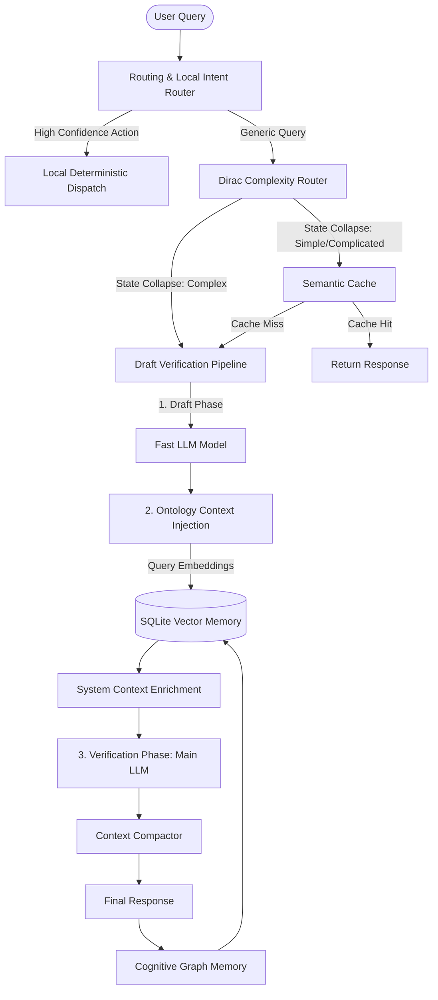

<div align="center">
  <div style="background:#0c1017;border:2px solid #3cd2a5;border-radius:12px;padding:32px 28px 24px;margin-bottom:24px;box-shadow:0 0 40px rgba(60,210,165,0.2)">
    <h1 style="color:#3cd2a5;font-family:'Courier New',Courier,monospace;letter-spacing:3px;font-weight:bold;margin:0 0 8px">🤖 KAI HARNESS</h1>
    <p style="color:#8a99ad;font-size:1.1em;margin:0 0 18px">Ultra-Lightweight Agentic AI Harness & Telemetry Engine for Web & SaaS Applications</p>
    <div style="display:flex;justify-content:center;gap:8px;flex-wrap:wrap">
      
      
      
      
      
      
    </div>
  </div>
</div>

---

## ⚡ The Real Value of PHP Kai Harness

**phpkaiharness** is an ultra-lightweight, production-grade AI Agent Harness and Standalone Web Dashboard built entirely using modern web technologies. Rather than relying on heavy, resource-intensive Python machine learning frameworks or dedicated GPU servers, it brings **SOTA Agentic AI orchestration to any Web or SaaS application** with zero friction.

### Why use PHP Kai Harness?
* **Zero-Infrastructure Overhead (1 CPU, 1GB RAM):** Runs side-by-side with your existing web app or SaaS app on standard, inexpensive hosting. No complex Python daemon setups or heavy ML environments required.
* **Auto-Discovery of Agentic AI:** Automatically discovers and hooks into your application's agentic AI capabilities in a simple, standardized way. **No need to build or replicate your core AI capabilities** inside `phpkaiharness` — it integrates seamlessly with whatever you already have.
* **Optimized for Qwen Cloud & Alibaba Cloud:** Built natively for **Qwen Cloud (Alibaba Cloud's DashScope API)**, PHP, and Laravel. It resolves credentials dynamically and integrates with the Laravel AI SDK.
* **Quantum & Dirac-Inspired Power:** The true strength of the harness lies in its advanced **Dirac-inspired Complexity Routing** and **Quantum-inspired Ontological Memory** — implementing cutting-edge mathematical concepts using simple, fast, and publicly available technologies like standard PHP and SQLite.

---

<div style="background:rgba(28,176,246,0.08);border:1px solid #1cb0f6;border-radius:8px;padding:16px;margin:20px 0;box-shadow:0 0 15px rgba(28,176,246,0.1)">
  <h3 style="color:#1cb0f6;margin-top:0;font-family:'Courier New',Courier,monospace;letter-spacing:1px">🏆 Global AI Hackathon Series — Qwen Cloud Edition</h3>
  <p style="color:#b1c2d4;font-size:0.95em;margin:0 0 10px;line-height:1.5">
    This repository is built for <strong>Track 1: MemoryAgent</strong>. It implements an autonomous, long-running agentic harness featuring a <strong>Dirac-inspired Dynamic Complexity Router</strong> and a <strong>Quantum-Inspired Ontological Memory Harness</strong>.
  </p>
  <div style="margin-top:15px;background:rgba(0,0,0,0.25);border:1px solid rgba(28,176,246,0.2);border-radius:6px;padding:12px">
    <h4 style="color:#1cb0f6;margin-top:0;font-family:'Courier New',Courier,monospace">📖 Deep Quantum Architecture Specifications:</h4>
    <ul style="color:#b1c2d4;font-size:0.9em;margin:0;padding-left:20px;line-height:1.6">
      <li>🌌 <strong><a href="doc/quantum/dirac_complexity_routing.md" style="color:#3cd2a5;text-decoration:none">Dirac Complexity Routing</a></strong>: Superposition state vector projection $| \psi \rangle = c_s | \text{Simple} \rangle + c_d | \text{Complicated} \rangle + c_x | \text{Complex} \rangle$ and measurement collapse.</li>
      <li>⚛️ <strong><a href="doc/quantum/quantum_ontological_memory.md" style="color:#3cd2a5;text-decoration:none">Quantum Ontological Memory</a></strong>: Cosine + phase wave interference ($S_{fused} = \alpha \cdot S_{cos} + \beta \cdot \cos(\theta_q - \theta_m)$) and entanglement twin pairing.</li>
      <li>💾 <strong><a href="doc/quantum/semantic_cache_dissipative_decay.md" style="color:#3cd2a5;text-decoration:none">Semantic Cache & Dissipative Decay</a></strong>: Concept density matrices ($\rho$) and exponential threshold shift decay ($T(t) = T_0 + (1 - T_0)(1 - e^{-\Gamma t})$) over time.</li>
      <li>🛡️ <strong><a href="doc/quantum/cache_verification_loop.md" style="color:#3cd2a5;text-decoration:none">QFT Cache Verification Loop</a></strong>: RAG/Verification pipeline, model existence validation, and semantic LLM verification passes.</li>
      <li>🔗 <strong><a href="doc/quantum/ontological_rag_injector.md" style="color:#3cd2a5;text-decoration:none">Ontological RAG Injector</a></strong>: Semantic vector embedding lookup and context envelope hydration.</li>
      <li>🕸️ <strong><a href="doc/quantum/cognitive_graph_memory.md" style="color:#3cd2a5;text-decoration:none">Cognitive Graph Memory</a></strong>: Fact triplet extraction, deduplication, edge weights coherence, and temporal graph decay.</li>
    </ul>
  </div>
</div>

---

## 🏗️ Core Architecture & Execution Flow

The harness processes queries through a highly optimized pipeline that filters, routes, executes, and verifies prompts using public web-scale technologies.



---

## ⚙️ Component Blueprint

Here is a simplified breakdown of each key component and how it functions under the hood:

### 1. Dirac Complexity Router
> **File:** [ComplexityClassifier.php](file:///s:/elasticcost/packages/phpkaiharness/src/Optimize/ComplexityClassifier.php)
* **What it is:** The "traffic controller" of the package. It acts like a sorting hat, analyzing a user's prompt to determine if it is **Simple**, **Complicated**, or **Complex**, so the system can choose the cheapest and fastest way to solve it.
* **How it works:**
  1. Tokenizes the prompt and maps it to a mathematical state vector $|\psi\rangle$ in a 3D Hilbert space.
  2. Applies a **Permutation Operator** (swapping adjacent token weights) to calculate the query's symmetry eigenvalue. Highly structured or repetitive prompts lean towards **Simple**.
  3. Scans for mutating keywords (e.g., `update`, `simulate`) to push the score towards **Complex**, and database entities (e.g., `client`, `sizing`) to push it towards **Complicated**.
  4. Triggers a **state collapse** (measurement) into the highest probability density domain, returning the chosen routing path.

### 2. Quantum-Inspired Memory Harness
> **File:** [QuantumInferenceEngine.php](file:///s:/elasticcost/packages/phpkaiharness/src/Optimize/QuantumInferenceEngine.php)
* **What it is:** An advanced agent memory database (stored in SQLite) that retrieves past interactions using wave interference and entanglement.
* **How it works:**
  1. **Phase Interference:** Every agent has a unique "phase angle" (e.g., Security is $0$, Data is $\pi/2$). When searching memory, it calculates a fused similarity score:
     $$\text{Fused Score} = \alpha \cdot \text{Vector Cosine Similarity} + \beta \cdot \cos(\theta_{\text{query}} - \theta_{\text{node}})$$
     This causes out-of-phase nodes to destructively interfere (be filtered out) and in-phase nodes to constructively interfere (be boosted).
  2. **Entanglement Traversal:** Nodes are linked as "entangled pairs" with an entanglement force. When the system retrieves a memory anchor, any entangled nodes are automatically pulled into context.

### 3. Ontology Context Injection
> **File:** [OntologicalContextInjector.php](file:///s:/elasticcost/packages/phpkaiharness/src/Optimize/OntologicalContextInjector.php)
* **What it is:** The bridge between the user's chat prompt and your Laravel Database. It automatically fetches real, current database records that are relevant to the user's question and feeds them directly to the AI.
* **How it works:**
  1. Embeds the user prompt into a vector.
  2. Scans records of the requested Laravel Model (like `ClientAsset`).
  3. Calculates the Cosine Similarity between the prompt vector and the database records.
  4. Formats the top-scoring records as JSON/text and injects them as a system context block into the prompt before sending it to the LLM.

### 4. Semantic Cache & Context Compactor
> **Files:** [SemanticCache.php](file:///s:/elasticcost/packages/phpkaiharness/src/Optimize/SemanticCache.php) | [ContextCompactor.php](file:///s:/elasticcost/packages/phpkaiharness/src/Optimize/ContextCompactor.php)
* **What they are:** 
  * **Semantic Cache:** A smart recycling bin. If a user asks a question that was asked before (even if worded differently), it returns the cached response instantly without calling the LLM.
  * **Context Compactor:** A context manager that shrinks the conversation history when it gets too long, preventing "Out of Memory" token errors.
* **How they work:**
  * **Semantic Cache:** Uses three-tier matching (Exact match, Levenshtein fuzzy string distance, and Vector Cosine Similarity). It filters out mutating commands, ensures numbers/digits match exactly, and verifies that the referenced DB entities still exist.
  * **Context Compactor:** When history exceeds limits, it slides the window (dropping intermediate tool logs while keeping the root query and the last few turns) or uses the LLM to summarize the intermediate history into a single compact system message.

### 5. Cognitive Graph Memory
> **File:** [CognitiveGraphMemory.php](file:///s:/elasticcost/packages/phpkaiharness/src/Optimize/CognitiveGraphMemory.php)
* **What it is:** A facts-harvester. After the agent finishes a task, it reads what happened, extracts new lessons, configurations, or facts, and saves them to the persistent graph database for future runs.
* **How it works:**
  1. Performs a post-execution LLM call asking for a flat list of concrete updates or discoveries from the trace.
  2. Runs the extracted statements through quality filters (minimum length, certainty checks, and markdown filters).
  3. Runs a deduplication check ($\ge 85\%$ string similarity check) against existing facts.
  4. Saves the unique, verified facts into SQLite, categorized as `setting_change`, `creation`, or `allocation`.

### 6. Draft Verification Pipeline
> **File:** [DraftVerificationOrchestration.php](file:///s:/elasticcost/packages/phpkaiharness/src/Optimize/DraftVerificationOrchestration.php)
* **What it is:** The "Think-twice" system. Before answering a complex question, the package writes a fast draft, retrieves confirming/challenging evidence, and then hands it to the main LLM to audit and generate the final answer.
* **How it works:**
  1. Calls a fast LLM to produce a quick, raw draft solution.
  2. Queries the SQLite vector memory and Eloquent database using the draft content to fetch matching records.
  3. Bundles the draft and evidence into a hidden system prompt, instructing the main LLM to audit the draft, ignore false assumptions, and produce the final polished response.

### 7. Routing & Local Intent
> **Files:** [LocalIntentRouter.php](file:///s:/elasticcost/app/Ai/Routing/LocalIntentRouter.php) | [LocalIntentEvidenceExtractor.php](file:///s:/elasticcost/app/Ai/Routing/LocalIntentEvidenceExtractor.php)
* **What it is:** A fast-track shortcut. If the user types a command that can be answered instantly using code (like "change SIEM price to $200"), it runs it locally in PHP instead of wasting time and tokens on the LLM.
* **How it works:**
  1. The `EvidenceExtractor` scans the prompt for Action Verbs, targets, and negative/hypothetical markers.
  2. It computes a confidence score. If it is a clear, actionable command (confidence $\ge 0.9$), the `LocalIntentRouter` classifies it as `local-intent-action`.
  3. The agent engineer intercepts this and executes the action deterministically in code, bypassing the LLM. If the intent is unclear, it falls back to the full LLM agent loop.

---

## ⚡ Quickstart

```php
use Phpkaiharness\Llm\QwenClient;
use Phpkaiharness\Llm\OllamaClient;
use Phpkaiharness\Llm\FailoverLlmClient;
use Phpkaiharness\Llm\PiiMaskingLlmClient;
use Phpkaiharness\Llm\RateLimitedLlmClient;
use Phpkaiharness\Core\AgentLoop;
use Phpkaiharness\Core\Registry\ToolRegistry;
use Phpkaiharness\Optimize\SemanticCache;
use Phpkaiharness\Optimize\Guardrails;
use Phpkaiharness\Monitor\SqliteMonitorStore;

// 1. Build a resilient LLM client stack optimized for Qwen Cloud (DashScope API)
$primary   = new QwenClient(defaultModel: 'qwen-plus');
$secondary = new OllamaClient('http://localhost:11434', 'llama3');

$llmClient = new PiiMaskingLlmClient(
    new RateLimitedLlmClient(
        new FailoverLlmClient([$primary, $secondary]),
        requestsPerMinute: 60
    )
);

// 2. Register tools with guardrails
$registry = new ToolRegistry();

// 3. Plug in semantic cache + telemetry store
$dbPath      = database_path('harness.sqlite');
$cache       = new SemanticCache($dbPath, threshold: 0.88);
$guardrails  = new Guardrails();
$collector   = new SqliteMonitorStore($dbPath);

// 4. Boot the loop
$agent = new AgentLoop(
    llmClient:       $llmClient,
    registry:        $registry,
    systemPrompt:    "You are a helpful agentic assistant.",
    model:           'qwen-plus',
    semanticCache:   $cache,
    guardrails:      $guardrails,
    maxIterations:   10
);

// 5. Run
$history   = [];
$sessionId = bin2hex(random_bytes(8));
$response  = $agent->run("Analyze our client asset inventory", $history, $sessionId, $collector);

echo $response;
```

---

## 🚀 Laravel 13 Integration in 3 Steps

1. **Install Package**: Add the VCS repository to your `composer.json` and require the package:
   ```bash
   composer config repositories.phpkaiharness vcs "https://github.com/K415mm/phpkaiharness.git"
   composer require K415mm/phpkaiharness:dev-main
   ```
2. **Publish & Install Config & Assets**: Run the installer command to publish configuration and assets and initialize the SQLite DB:
   ```bash
   php artisan harness:install
   ```
3. **Access the Telemetry Dashboard**: Start your server (`php artisan serve`) then open:
   * 📊 Workflow Trace Viewer & Agent Runner: `/harness/dashboard`
   * ⚙️ Configuration Panel: `/harness/config`

---

## 🖥️ Standalone Web Application Dashboard (Non-Laravel)

If you are not using Laravel, or want to deploy the telemetry, trace runner, and configuration dashboard as a standalone web application, you can do so in seconds using the built-in standalone web app located in the `/ui` directory.

### 1. Running Standalone Web App
Launch the built-in development server pointing to the UI router:
```bash
# Run from the packages/phpkaiharness directory
php -S localhost:8000 ui/router.php
```
Open your browser to [http://localhost:8000](http://localhost:8000) to access the cyber-teal dashboard.

### 2. Standalone Session and Configuration Store
* **Autopilot API Engine** (`ui/api.php`): Directly interfaces with standalone scripts to record runs, traces, and metrics.
* **Independent SQLite Storage**: Automatically seeds and persists settings, model parameters, and telemetry events in `storage/app/phpkaiharness/agent_memory.sqlite` without requiring a MySQL/PostgreSQL host database.

---

## 🧩 LLM Provider Stack

| Provider | Class | Notes |
|---|---|---|
| **Qwen Cloud** (default) | `QwenClient` | DashScope API, hybrid credentials, qwen3/qwq `enable_thinking=false`, structured JSON output, streaming |
| **Ollama** (local) | `OllamaClient` | Hermes 3, Llama 3, Gemma 4, Qwen 3.5+ |
| **LM Studio** (local) | `LmStudioClient` | Standard REST chat completions API |
| **OpenRouter** (cloud) | `OpenRouterClient` | 200+ models via single API key |
| **laravel/ai** | `LaravelAiClient` | Native Laravel 13 AI SDK connections, auto-routes qwen→QwenClient |
| **Failover Stack** | `FailoverLlmClient` | Wraps any of the above with auto-retry |

---

## 🧪 Testing

```bash
# Run all 93 tests
composer test

# Or directly via PHPUnit
./vendor/bin/phpunit
```

---

## 🤝 License

This project is licensed under the **MIT License**.
