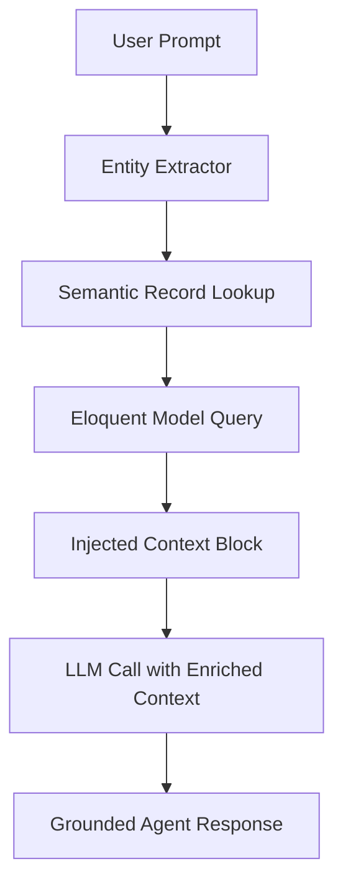
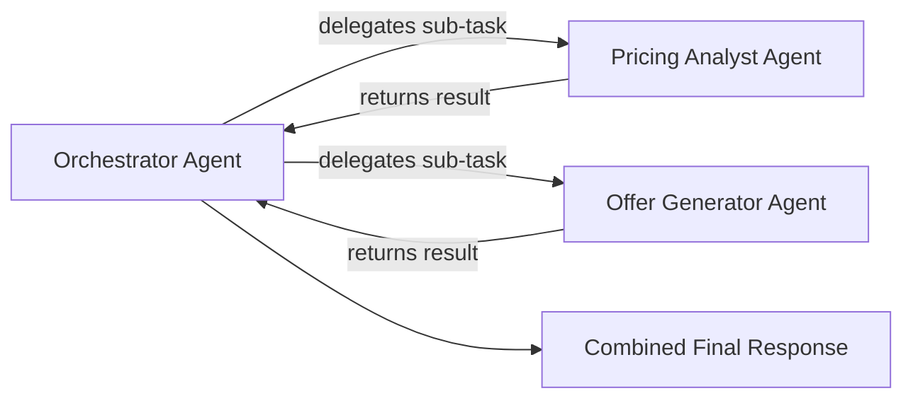

# Ontological Context Injection & Interoperability Guide

This guide covers the **Ontological Context Injector** pattern in `phpkaiharness` — how the harness grounds agent responses in live application data, and how it integrates with external systems via webhooks and async tool calls.

---

## 1. Overview

Modern agentic systems perform poorly when they operate on stale or hallucinated knowledge. The `OntologicalContextInjector` solves this by connecting the agent loop to live application records before each LLM call, ensuring the model reasons over real, up-to-date data rather than its training knowledge alone.

The pattern has three layers:

| Layer | Purpose |
|---|---|
| **Context Enrichment** | Inject relevant database records as context before each LLM call |
| **Agent Actions** | Allow the agent to trigger structured write-back actions on your data |
| **Async Interoperability** | Bridge to external systems via webhooks and async task queues |

---

## 2. Core Concept: The Ontological Layer



Instead of sending the LLM a raw prompt, the injector:

1. **Extracts key entities** from the prompt (names, IDs, domain terms)
2. **Queries your Eloquent models** using keyword or embedding-based similarity
3. **Prepends the matching records** as a structured `system`-role context block
4. **Calls the LLM** with the enriched prompt, producing a response grounded in your actual data

---

## 3. Configuration

```php
// config/harness.php
'ontological_injector' => [
    'enabled'  => true,
    'models'   => [
        \App\Models\Offer::class,
        \App\Models\Product::class,
        \App\Models\Customer::class,
    ],
    'max_docs' => 5,       // Maximum records injected per call
],
```

---

## 4. How Record Retrieval Works

### Keyword-based (Default)

The injector extracts noun phrases from the prompt and runs an Eloquent `where LIKE` query across configured model text columns.

```php
// Automatically runs something like:
Offer::where('title', 'LIKE', "%{$entity}%")
     ->orWhere('description', 'LIKE', "%{$entity}%")
     ->limit(5)
     ->get();
```

### Vector Embedding-based (Advanced)

For semantic matching, plug in an embedding adapter that scores records by cosine similarity:

```php
// In your AppServiceProvider
$injector = app(OntologicalContextInjector::class);
$injector->setEmbeddingAdapter(new YourEmbeddingAdapter());
```

---

## 5. Agent Actions (Write-back)

Beyond reading data, the agent can write back to your application through structured **tool calls** that map to Eloquent model mutations:

```php
class UpdateOfferStatusTool implements ToolInterface
{
    public function name(): string { return 'update_offer_status'; }

    public function description(): string
    {
        return 'Updates the status of an offer in the system.';
    }

    public function schema(): array
    {
        return [
            'type'       => 'object',
            'properties' => [
                'offer_id' => ['type' => 'string'],
                'status'   => ['type' => 'string', 'enum' => ['active', 'expired', 'pending']],
            ],
            'required' => ['offer_id', 'status'],
        ];
    }

    public function execute(array $args): string
    {
        $offer = Offer::findOrFail($args['offer_id']);
        $offer->update(['status' => $args['status']]);
        return "Offer {$args['offer_id']} updated to status: {$args['status']}.";
    }
}
```

Register it:
```php
$registry->attach(new UpdateOfferStatusTool());
```

The agent can now update application records autonomously — all gated behind `Guardrails` policy validation before execution.

---

## 6. Async Interoperability (`AsynchronousWebhookTool`)

The harness bridges to external systems via the `AsynchronousWebhookTool`. This allows the agent to trigger operations in downstream services (ERPs, CRMs, data warehouses) without blocking the agent loop.

```php
$registry->attach(new AsynchronousWebhookTool(
    name:        'notify_external_service',
    description: 'Sends a structured event to an external system endpoint.',
    endpoint:    env('EXTERNAL_WEBHOOK_URL'),
    headers:     ['Authorization' => 'Bearer ' . env('EXTERNAL_API_TOKEN')],
));
```

**How it works:**
1. Agent decides to call `notify_external_service` with a payload
2. `AsynchronousWebhookTool` dispatches an HTTP POST to the configured endpoint in the background
3. Returns a correlation ID to the agent loop immediately (non-blocking)
4. The external system processes the event and optionally calls back via a webhook

---

## 7. Multi-agent Delegation

For complex workflows, the agent can delegate sub-tasks to specialized child agents using `AgentDelegationTool`:



```php
$registry->attach(new AgentDelegationTool(
    name:        'delegate_pricing_analysis',
    description: 'Delegates pricing analysis to a specialist agent.',
    agent:       new AgentLoop(
                     llmClient:    $llmClient,
                     registry:     $pricingRegistry,
                     systemPrompt: 'You are a pricing analyst. Evaluate cost structures.',
                     model:        'hermes-3-llama-3-8b',
                 )
));
```

---

## 8. Laravel AI SDK Integration

`phpkaiharness` integrates natively with the `laravel/ai` SDK via `LaravelAiClient`. This allows using any Laravel AI connection defined in `config/ai.php` as a drop-in LLM backend:

```php
// config/ai.php defines your AI connections
// phpkaiharness wraps them transparently

$llmClient = new LaravelAiClient(
    connectionName: 'default',   // matches a key in config/ai.connections
    defaultModel:   'gpt-4o-mini'
);
```

This means any model added to the Laravel AI connection pool — whether cloud or local — is immediately usable as a harness LLM backend without code changes.

---

## 9. Security Considerations

All agent-initiated data mutations and external calls are subject to:

1. **Guardrails validation** — tool arguments are checked before any execution
2. **PII masking** — sensitive data in outgoing payloads is redacted
3. **Rate limiting** — outbound calls are throttled per the configured bucket
4. **Scope control** — `PolicyGuardrailMiddleware` enforces route-level access policies

Never expose the harness routes publicly without adding `auth` middleware to `config('harness.telemetry.middleware')`.
