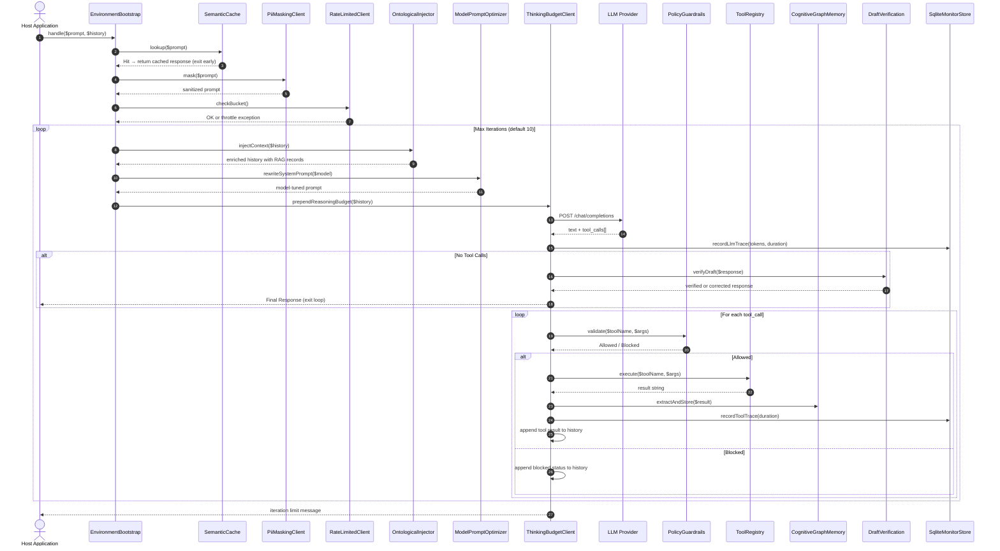
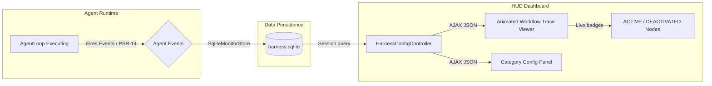

# High-Level Architecture (HLA)

This document provides a comprehensive view of the `phpkaiharness` architecture — how framework modules, external LLM endpoints, middleware layers, and the host application interact to run autonomous agent loops securely.

---

## 1. System Context Diagram

```mermaid
flowchart TD
    User([End User]) <-->|Accesses Dashboard & Traces| LaravelHost[Laravel 13 Host App]
    LaravelHost <-->|Binds & Boots Service Provider| Package[phpkaiharness Package]

    subgraph Middleware Pipeline
        MW1[EnvironmentBootstrapMiddleware]
        MW2[PolicyGuardrailMiddleware]
        MW3[CompressContextMiddleware]
    end

    subgraph Package Core
        Loop[AgentLoop Runtime] <-->|Resolves Tools| Registry[ToolRegistry]
        Loop <-->|Queries LLM| LlmClient[LlmClientInterface]
        Loop --> |Dispatches Traces| Store[(SqliteMonitorStore)]
    end

    subgraph LLM Client Stack
        LlmClient --> Failover[FailoverLlmClient]
        Failover --> PII[PiiMaskingLlmClient]
        PII --> RateLimit[RateLimitedLlmClient]
        RateLimit --> Thinking[ThinkingBudgetLlmClient]
    end

    subgraph LLM Providers
        Thinking <-->|HTTP POST| QwenCloud[Qwen Cloud - DashScope]
        Thinking <-->|HTTP POST| Ollama[Ollama - Local]
        Thinking <-->|HTTP POST| LMStudio[LM Studio - Local]
        Thinking <-->|HTTP POST| OpenRouter[OpenRouter - Cloud]
        Thinking <-->|Laravel Ai Driver| LaravelAi[laravel/ai Connection]
    end

    subgraph Optimization Layer
        Loop --> SemanticCache[SemanticCache]
        Loop --> Compact[ContextCompactor]
        Loop --> Optimizer[ModelPromptOptimizer]
        Loop --> Ontology[OntologicalContextInjector]
        Loop --> GraphMem[CognitiveGraphMemory]
        Loop --> DraftVerify[DraftVerificationOrchestration]
    end

    subgraph Tool Execution
        Registry <-->|proc_open| WSL[Kali WSL Terminal]
        Registry <-->|guzzle/http| Microservices[External HTTP Microservices]
        Registry <-->|Native PHP| PHPClass[Native PHP Tools]
        Registry <-->|Webhook| AsyncTool[AsynchronousWebhookTool]
        Registry <-->|Child Loop| SubAgent[AgentDelegationTool]
    end

    Package <--> Middleware Pipeline
    Store --> Controller[HarnessConfigController]
    Controller --> |Renders Blade + AJAX JSON| LaravelHost
```

---

## 2. Middleware Pipeline

Requests to the harness pass through three HTTP middleware layers before reaching agent logic:

| Middleware | Responsibility |
|---|---|
| `EnvironmentBootstrapMiddleware` | Validates environment, loads harness config, bootstraps SQLite store |
| `PolicyGuardrailMiddleware` | Enforces scope-level access policies before tool execution |
| `CompressContextMiddleware` | Compresses large context payloads before passing them to the AgentLoop |

Each middleware respects the feature toggle in `config/harness.php` and is bypassed (no-op pass-through) when disabled. The dashboard trace viewer shows middleware nodes as **green (ACTIVE)** or **red (DEACTIVATED)** based on live config state.

---

## 3. Full Execution Flow

The following sequence tracks the lifecycle of a single prompt from entry to final response:



---

## 4. Telemetry & Analytics Pipeline

`phpkaiharness` uses a self-contained SQLite database — never writing to the host application's primary database.



### PSR-14 Event Hooks

The `AgentLoop` fires the following event objects at each stage:

| Event | Trigger |
|---|---|
| `AgentStarted` | Loop begins processing a prompt |
| `LlmCallStarted` / `LlmCallFinished` | Before/after each LLM HTTP request |
| `LlmStreamChunkReceived` | Per-token during streaming mode |
| `ToolCallStarted` / `ToolCallFinished` | Before/after each tool execution |
| `AgentFinished` | Loop halts (success, error, iteration limit) |

---

## 5. Configuration Persistence & UI State

The dashboard Configuration Panel persists feature toggles to `config/harness.php` (standalone) or via `HarnessConfigController` (Laravel). Each feature node in the Execution Trace Viewer reflects the saved state:

- 🟢 **ACTIVE** — feature is enabled and running
- 🔴 **DEACTIVATED** — feature is disabled; the loop bypasses it
