# Low-Level Architecture (LLA): Component Specifications

This document provides detailed API references, class properties, and responsibilities for all components in `phpkaiharness`.

---

## 1. Core Engine

### `AgentLoop` (`Core\AgentLoop`)

The central runtime engine. Drives the LLM thought-action-observation cycle, dispatching events, managing context, and orchestrating all optimization and safety layers.

**Constructor:**
```php
new AgentLoop(
    llmClient:       LlmClientInterface,
    registry:        ToolRegistry,
    systemPrompt:    string,
    model:           string,
    maxIterations:   int              = 10,
    semanticCache:   ?SemanticCache   = null,
    contextCompactor: ?ContextCompactor = null,
    guardrails:      ?Guardrails      = null,
    monitor:         ?SqliteMonitorStore = null,
)
```

**Key Methods:**
```php
run(
    string $userPrompt,
    array &$history      = [],
    ?string $sessionId   = null,
    ?AnalyticsCollectorInterface $collector = null,
    ?callable $onChunk   = null  // SSE streaming callback
): string
```

### `AgentSelector` (`Core\AgentSelector`)

Scans directories to discover and register pre-configured `AgentLoop` instances from class definitions or config arrays.

---

## 2. LLM Client Layer

All clients implement `Phpkaiharness\Contracts\LlmClientInterface`:

```php
interface LlmClientInterface {
    public function chat(
        string $systemPrompt,
        array  $history,
        array  $tools,
        string $model,
        ?string $sessionId                       = null,
        ?AnalyticsCollectorInterface $collector  = null,
        ?callable $onChunk                       = null
    ): array;
}
```

### Class Hierarchy

```mermaid
classDiagram
    class LlmClientInterface { <<interface>> }

    class OllamaClient { +url +defaultModel }
    class LmStudioClient { +url +defaultModel }
    class OpenRouterClient { +apiKey +defaultModel }
    class LaravelAiClient { +connectionName +defaultModel }

    class FailoverLlmClient {
        +clients: LlmClientInterface[]
        Retries on exception → next client
    }
    class PiiMaskingLlmClient {
        +wrapped: LlmClientInterface
        +patterns: array
        Masks before send, unmasks on response
    }
    class RateLimitedLlmClient {
        +wrapped: LlmClientInterface
        +requestsPerMinute: int
        Token-bucket via SQLite counter
    }
    class ThinkingBudgetLlmClient {
        +wrapped: LlmClientInterface
        +maxThinkingTokens: int
        Prepends think→act→observe scaffold
    }

    LlmClientInterface <|.. OllamaClient
    LlmClientInterface <|.. LmStudioClient
    LlmClientInterface <|.. OpenRouterClient
    LlmClientInterface <|.. LaravelAiClient
    LlmClientInterface <|.. FailoverLlmClient
    LlmClientInterface <|.. PiiMaskingLlmClient
    LlmClientInterface <|.. RateLimitedLlmClient
    LlmClientInterface <|.. ThinkingBudgetLlmClient
```



### Decorator Composition Example

```php
$llm = new PiiMaskingLlmClient(
    new RateLimitedLlmClient(
        new ThinkingBudgetLlmClient(
            new FailoverLlmClient([
                new OllamaClient('http://localhost:11434', 'hermes-3-llama-3-8b'),
                new OpenRouterClient($apiKey, 'meta-llama/llama-3-8b-instruct'),
            ]),
            maxThinkingTokens: 8000
        ),
        requestsPerMinute: 60
    )
);
```

### `ModelCatalog`

Maintains a registry of known model identifiers and their architectures. Used by `ModelPromptOptimizer` to auto-select the correct prompt rewriting profile.

---

## 3. Middleware Layer

HTTP middleware runs before agent logic on all harness routes.

### `EnvironmentBootstrapMiddleware`

Validates the harness environment on every request:
- Checks `config/harness.php` is loaded and accessible
- Initialises the `SqliteMonitorStore` if not already booted
- Sets runtime constants for telemetry collection

**Configurable:** Can be disabled via `config('harness.telemetry.enabled')`.

### `PolicyGuardrailMiddleware`

Enforces route-level access policies:
- Blocks requests to restricted harness routes if the caller's scope does not match configured allow-lists
- Returns a JSON `403` with policy violation reason if blocked

### `CompressContextMiddleware`

Intercepts large context payloads before they reach the loop:
- Detects oversized `$history` arrays in request payloads
- Applies sliding-window truncation to keep context within token budget

---

## 4. Optimization & Intelligence Layer

### `SemanticCache` (`Optimize\SemanticCache`)

```sql
CREATE TABLE IF NOT EXISTS semantic_cache (
    id         INTEGER PRIMARY KEY AUTOINCREMENT,
    prompt     TEXT UNIQUE,
    prompt_hash TEXT,
    response   TEXT,
    created_at TIMESTAMP DEFAULT CURRENT_TIMESTAMP
);
```

**Methods:**
```php
lookup(string $prompt): ?string     // Returns cached response or null
store(string $prompt, string $response): void
```

Similarity matching uses a configurable Levenshtein-distance threshold (default: `0.88`). Future versions plug in vector embedding backends.

---

### `ContextCompactor` (`Optimize\ContextCompactor`)

Monitors `$history` token count. When the turn count exceeds `window_size` (default: 6), it drops the oldest user/assistant exchange pairs while always preserving the system prompt at index 0.

---

### `Guardrails` (`Optimize\Guardrails`)

Policy engine that validates tool call safety before execution:

```php
validate(string $toolName, array $arguments): bool|string
// Returns true (allowed) or a blocked-reason string
```

Built-in rules block:
- Shell injection characters (`;`, `&&`, `|`, `` ` ``, `$()`)
- Forbidden binary names not in whitelist
- Argument values exceeding length limits

---

### `ModelPromptOptimizer` (`Optimize\ModelPromptOptimizer`)

Rewrites system prompts for specific model architectures to maximize instruction-following:

| Profile | Target Models |
|---|---|
| `qwen` | Qwen 2.5, Qwen 3, Qwen 3.5 |
| `gemma` | Gemma 2, Gemma 4 |
| `llama` | Llama 3, Llama 3.1, Hermes 3 |
| `auto` | Auto-detected from `ModelCatalog` |

---

### `OntologicalContextInjector` (`Optimize\OntologicalContextInjector`)

RAG-style context enrichment:

1. Receives current `$history` and extracts key entities
2. Queries relevant Eloquent models via embedding similarity
3. Prepends a `system`-role context block with retrieved records before LLM call

Configure the target Eloquent models and embedding adapter in `config/harness.php`.

---

### `CognitiveGraphMemory` (`Optimize\CognitiveGraphMemory`)

Persistent cross-session knowledge graph stored in the harness SQLite database:

```sql
CREATE TABLE IF NOT EXISTS graph_nodes (
    id         INTEGER PRIMARY KEY AUTOINCREMENT,
    entity     TEXT,
    type       TEXT,
    properties TEXT,   -- JSON blob
    created_at TIMESTAMP
);
CREATE TABLE IF NOT EXISTS graph_edges (
    id          INTEGER PRIMARY KEY AUTOINCREMENT,
    from_entity TEXT,
    relation    TEXT,
    to_entity   TEXT,
    weight      REAL DEFAULT 1.0,
    session_id  TEXT,
    created_at  TIMESTAMP
);
```

After each tool execution result, `CognitiveGraphMemory` extracts entities and relationships, upserts them into the graph, and makes them queryable via `QueryGraphMemoryTool`.

---

### `DraftVerificationOrchestration` (`Optimize\DraftVerificationOrchestration`)

Runs a secondary verification pass before the loop returns a final response:

1. Sends the draft response to a verifier LLM call with a critique prompt
2. If the verifier flags factual errors or hallucinations, returns a corrected version
3. If verified, returns the original draft

Can be pointed at a different, faster model (e.g. `qwen2.5:0.5b`) for the verification pass to keep latency low.

---

### `ThinkingBudgetLlmClient` (`Llm\ThinkingBudgetLlmClient`)

Decorator that prepends a structured reasoning scaffold to the message history before the LLM call:

```
[THINK]: What do I know? What tools do I have? What is the safest next action?
[ACT]: Call tool X with args Y
[OBSERVE]: The result of action X was Z
```

Controlled via `config('harness.thinking_budget.max_thinking_tokens')`.

---

## 5. Tool Registry & Pluggable Tools

### `ToolRegistry` (`Core\Registry\ToolRegistry`)

| Method | Description |
|---|---|
| `attach(ToolInterface $tool)` | Registers a tool |
| `detach(string $name)` | Removes a tool by name |
| `serializeSchemas(): array` | Returns standard JSON schemas for all registered tools |

### Built-in Tools

| Tool Class | Purpose |
|---|---|
| `WslCommandTool` | Executes whitelisted binaries in Kali WSL via `proc_open` |
| `HttpServiceTool` | Bridges to external REST microservices (Python/Node.js) |
| `AgentDelegationTool` | Spawns a child `AgentLoop` for sub-task delegation |
| `AsynchronousWebhookTool` | Dispatches async webhook events with callback tracking |
| `QueryGraphMemoryTool` | Queries the `CognitiveGraphMemory` graph by entity/relation |

---

## 6. Telemetry Monitor

### `SqliteMonitorStore` (`Monitor\SqliteMonitorStore`)

The sole persistence adapter for all telemetry, config, semantic cache, and graph memory — using a single self-contained `harness.sqlite` file.

**Schema overview:**

```sql
-- Agent session records
CREATE TABLE sessions (...);

-- Per-step LLM + tool traces
CREATE TABLE traces (...);

-- Semantic response cache
CREATE TABLE semantic_cache (...);

-- Cognitive graph nodes & edges
CREATE TABLE graph_nodes (...);
CREATE TABLE graph_edges (...);
```

`SqliteMonitorStore` implements both `AnalyticsCollectorInterface` (for recording) and serves read queries for the HUD dashboard controllers.
