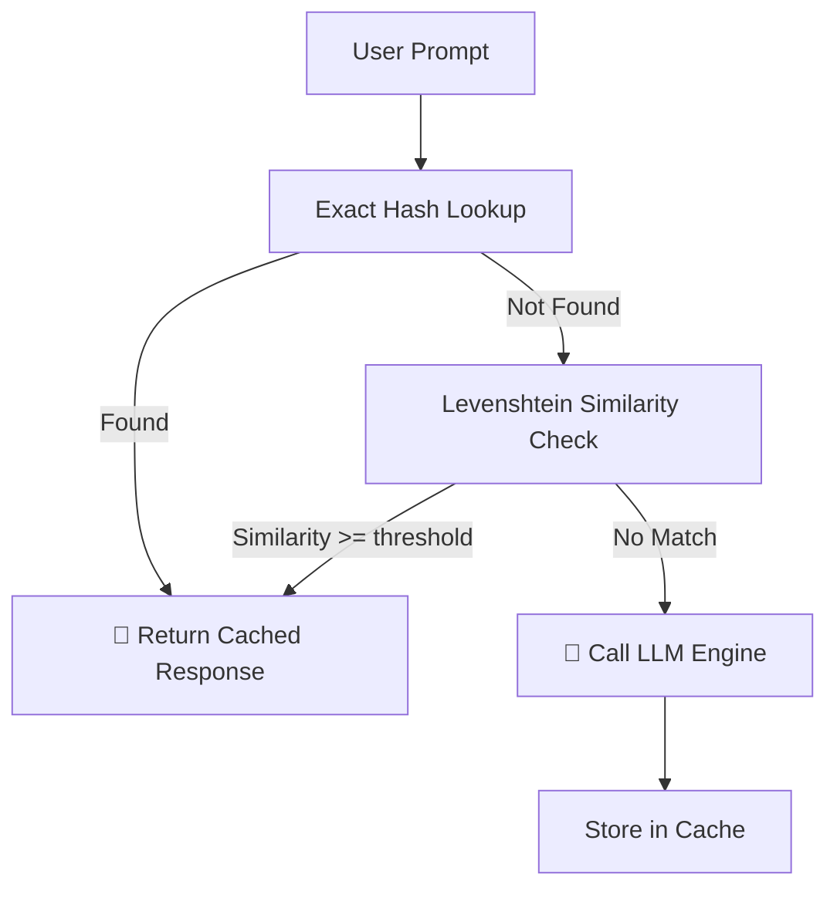

# phpkaiharness Feature Reference Guide

A complete reference for all features, safety layers, and optimization systems in `phpkaiharness`. Each feature is independently togglable via `config/harness.php` and reflected live in the HUD dashboard.

---

## Feature Toggle Map

| Feature | Config Key | Default | Status in Dashboard |
|---|---|---|---|
| Semantic Cache | `semantic_cache.enabled` | `true` | 🟢 ACTIVE / 🔴 DEACTIVATED |
| PII Masking | `pii_masking.enabled` | `true` | 🟢 / 🔴 |
| Rate Limiting | `rate_limiting.enabled` | `true` | 🟢 / 🔴 |
| Guardrails | `guardrails.enabled` | `true` | 🟢 / 🔴 |
| Model Prompt Optimizer | `model_prompt_optimizer.enabled` | `true` | 🟢 / 🔴 |
| Ontological Injector | `ontological_injector.enabled` | `true` | 🟢 / 🔴 |
| Thinking Budget | `thinking_budget.enabled` | `false` | 🟢 / 🔴 |
| Cognitive Graph Memory | `cognitive_graph_memory.enabled` | `true` | 🟢 / 🔴 |
| Draft Verification | `draft_verification.enabled` | `false` | 🟢 / 🔴 |
| Context Compactor | `context_compactor.enabled` | `true` | 🟢 / 🔴 |
| LLM Failover | `llm_failover.enabled` | `true` | 🟢 / 🔴 |
| Streaming | `streaming.enabled` | `false` | 🟢 / 🔴 |

> **Config changes save immediately** and are picked up on the next agent loop invocation — no server restart required.

---

## 1. Standalone Telemetry Store (SQLite)

All telemetry, cache, and memory data is stored in a self-contained SQLite database — completely independent of the host application's database.

### Full Schema

```sql
-- Agent execution sessions
CREATE TABLE IF NOT EXISTS sessions (
    id                 TEXT PRIMARY KEY,
    prompt             TEXT,
    response           TEXT,
    method             TEXT,
    total_duration_ms  INTEGER DEFAULT 0,
    iterations         INTEGER DEFAULT 0,
    created_at         TIMESTAMP DEFAULT CURRENT_TIMESTAMP
);

-- Step-level LLM & tool traces per session
CREATE TABLE IF NOT EXISTS traces (
    id                  INTEGER PRIMARY KEY AUTOINCREMENT,
    session_id          TEXT,
    type                TEXT,   -- 'llm_call' | 'tool_call'
    name                TEXT,
    input               TEXT,
    output              TEXT,
    duration_ms         INTEGER DEFAULT 0,
    tokens_prompt       INTEGER DEFAULT 0,
    tokens_completion   INTEGER DEFAULT 0,
    created_at          TIMESTAMP DEFAULT CURRENT_TIMESTAMP,
    FOREIGN KEY(session_id) REFERENCES sessions(id) ON DELETE CASCADE
);

-- Semantic response cache
CREATE TABLE IF NOT EXISTS semantic_cache (
    id          INTEGER PRIMARY KEY AUTOINCREMENT,
    prompt      TEXT UNIQUE,
    prompt_hash TEXT,
    response    TEXT,
    created_at  TIMESTAMP DEFAULT CURRENT_TIMESTAMP
);

-- Cognitive graph nodes (entities)
CREATE TABLE IF NOT EXISTS graph_nodes (
    id         INTEGER PRIMARY KEY AUTOINCREMENT,
    entity     TEXT,
    type       TEXT,
    properties TEXT,  -- JSON
    created_at TIMESTAMP DEFAULT CURRENT_TIMESTAMP
);

-- Cognitive graph edges (relationships)
CREATE TABLE IF NOT EXISTS graph_edges (
    id          INTEGER PRIMARY KEY AUTOINCREMENT,
    from_entity TEXT,
    relation    TEXT,
    to_entity   TEXT,
    weight      REAL DEFAULT 1.0,
    session_id  TEXT,
    created_at  TIMESTAMP DEFAULT CURRENT_TIMESTAMP
);
```

---

## 2. Semantic Cache (`Optimize\SemanticCache`)

Returns cached responses for semantically similar prompts, dramatically reducing LLM calls on repetitive workloads.



**Configuration:**
```php
'semantic_cache' => [
    'enabled'   => true,
    'threshold' => 0.88,   // 88% similarity = cache hit
],
```

---

## 3. PII Masking (`Llm\PiiMaskingLlmClient`)

Automatically redacts sensitive data before any prompt leaves the application.

**Default patterns:**

| Pattern Key | Regex | Replacement |
|---|---|---|
| `EMAIL` | `/[a-zA-Z0-9._%+-]+@[a-zA-Z0-9.-]+\.[a-zA-Z]{2,}/` | `[MASKED_EMAIL]` |
| `IP` | `/\b\d{1,3}\.\d{1,3}\.\d{1,3}\.\d{1,3}\b/` | `[MASKED_IP]` |
| `CREDIT_CARD` | `/\b(?:\d[ -]*?){13,16}\b/` | `[MASKED_CARD]` |
| `API_KEY` | `/(?i)(api[-_]?key\|secret\|token)[\s]*[:=][\s]*["']?[a-zA-Z0-9]{16,}["']?/` | `[MASKED_KEY]` |

Masking is applied **symmetrically** — outgoing prompts are masked before being sent to the LLM, and incoming responses are scanned for any leaked PII that slipped through.

Custom patterns can be added via `config('harness.pii_masking.patterns')`.

---

## 4. Rate Limiting (`Llm\RateLimitedLlmClient`)

Prevents runaway token consumption and avoids HTTP 429 errors from cloud providers.

**Algorithm:** Sliding-window token bucket stored in the SQLite monitor database.

```php
'rate_limiting' => [
    'enabled'             => true,
    'requests_per_minute' => 60,
],
```

When the limit is exceeded, the decorator throws a `RateLimitExceededException` which the `AgentLoop` catches and surfaces as a graceful error message.

---

## 5. LLM Failover (`Llm\FailoverLlmClient`)

Accepts a prioritized array of `LlmClientInterface` instances. On HTTP connection failure or exception from the primary provider, it logs the error and silently promotes the next client in the stack.

```php
new FailoverLlmClient([
    new OllamaClient(...),        // Primary
    new LmStudioClient(...),      // Secondary
    new OpenRouterClient(...),    // Tertiary fallback
])
```

The failover chain is attempted in order. If all providers fail, the exception from the last provider is re-thrown.

---

## 6. Guardrails (`Optimize\Guardrails`)

Scope-based safety engine that validates every tool call before execution.

**Built-in blocking rules:**
- **Shell injection:** Rejects arguments containing `;`, `&&`, `|`, `` ` ``, `$()`
- **Binary whitelist:** Only binaries explicitly listed in `WslCommandTool::$allowedBinaries` are permitted
- **Length limits:** Arguments exceeding 1024 chars are rejected
- **Custom rules:** Extend `Guardrails` to add application-specific policies

```php
'guardrails' => [
    'enabled'      => true,
    'max_arg_length' => 1024,
],
```

---

## 7. Model Prompt Optimizer (`Optimize\ModelPromptOptimizer`)

Auto-rewrites system prompts for specific model architectures to improve tool-call accuracy and instruction following.

**Built-in profiles:**

| Profile | Optimizations Applied |
|---|---|
| `qwen` | Uses `<|im_start|>` / `<|im_end|>` chat format markers, concise tool descriptions |
| `gemma` | Strips markdown formatting, uses plain-text system blocks |
| `llama` | Adds `<s>` BOS tokens, Hermes-style function call templates |
| `auto` | Queries `ModelCatalog` to select profile from model name |

---

## 8. Ontological Injector (`Optimize\OntologicalContextInjector`)

RAG-style context enrichment that grounds the agent's responses in live application data.

**Flow:**
1. Extracts key entities and intent from the current prompt
2. Queries configured Eloquent models using semantic similarity (vector embeddings or keyword matching)
3. Prepends a `system`-role message block with the retrieved records before the LLM call

```php
'ontological_injector' => [
    'enabled'  => true,
    'models'   => [\App\Models\Offer::class, \App\Models\Product::class],
    'max_docs' => 5,
],
```

---

## 9. Thinking Budget (`Llm\ThinkingBudgetLlmClient`)

Injects a structured chain-of-thought scaffold into the message history before each LLM call:

```
[THINK]: What is known? What tools are available? What is the optimal next action?
[ACT]: <selected tool and arguments>
[OBSERVE]: <tool result>
```

This pattern significantly improves multi-step planning quality on complex tasks (e.g., security analysis, multi-hop data lookups).

```php
'thinking_budget' => [
    'enabled'            => false,  // Disabled by default — enable for complex workflows
    'max_thinking_tokens' => 8000,
],
```

---

## 10. Cognitive Graph Memory (`Optimize\CognitiveGraphMemory`)

Persistent knowledge graph that accumulates observations across agent sessions.

After each tool execution result, the system:
1. Extracts named entities and their relationships from the result text
2. Upserts nodes and edges into the SQLite graph tables
3. Makes the graph queryable via the `QueryGraphMemoryTool`

This enables long-running agents to build up domain knowledge over time — e.g., a network scanning agent that remembers previously discovered hosts, open ports, and service fingerprints.

```php
'cognitive_graph_memory' => [
    'enabled' => true,
],
```

---

## 11. Draft Verification (`Optimize\DraftVerificationOrchestration`)

Adds a self-critique layer before the agent returns a final response:

1. Sends the draft response to a lightweight verifier LLM call with a critique prompt
2. If the verifier flags factual errors, hallucinations, or incomplete answers, it returns a corrected draft
3. If verified as accurate, returns the original response unchanged

Point the verifier at a fast, small model (e.g., `qwen2.5:0.5b`) to keep latency overhead minimal.

```php
'draft_verification' => [
    'enabled'          => false,  // Enable for high-stakes output workflows
    'verifier_model'   => 'qwen2.5:0.5b',
    'verifier_provider' => 'ollama',
],
```

---

## 12. Context Compactor (`Optimize\ContextCompactor`)

Prevents context overflow on long agent sessions by applying sliding-window truncation to the `$history` array.

```php
'context_compactor' => [
    'enabled'     => true,
    'window_size' => 6,  // Keep last N user/assistant turn pairs
],
```

The system prompt at index 0 is always preserved regardless of window size.

---

## 13. WSL Sandbox (`Tools\WslCommandTool`)

Runs terminal commands inside a Kali Linux WSL instance with a zero-trust security model:

1. **Binary Whitelist:** Rejects any binary not in `$allowedBinaries`
2. **Argument Escaping:** All arguments sanitized via `escapeshellarg()` — shell operators rendered inert
3. **Process Isolation:** Executed via `proc_open` with captured stdout/stderr and a strict 10-second timeout
4. **Exit Code Checking:** Non-zero exit codes are surfaced as error messages to the LLM

---

## 14. HUD Telemetry Dashboard

The built-in web UI accessible at `/harness/dashboard` and `/harness/config`:

### Workflow Trace Viewer (`/harness/dashboard`)
- **Animated node graph** — each step in the agent loop rendered as a live node (LLM call, tool call, cache hit, guardrail block)
- **Color-coded status** — green nodes for active features, red for deactivated, amber for warnings
- **Real-time metrics** — token counts, durations, and iteration numbers per node
- **Session explorer** — click any session row to expand its full step-by-step trace

### Category Config Panel (`/harness/config`)
- **Grouped by category** — LLM providers, optimization features, safety features, telemetry settings
- **Live status badges** — `[ACTIVE]` and `[DEACTIVATED]` badges update instantly on toggle
- **Persistent saves** — configuration changes write through to `config/harness.php` immediately
- **Visual feedback** — deactivated feature cards rendered in muted red tones; active cards in teal
